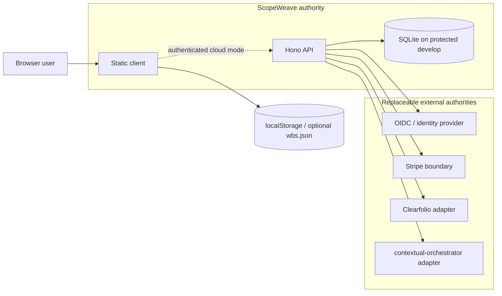

# ScopeWeave Architecture

This document describes the architecture **implemented on protected `develop`**. Open pull requests and issue designs are not shipped truth until they integrate through the repository rulesets.

## 1. Product contexts

ScopeWeave deliberately supports two deployment profiles over one planning model.

### Standalone planner

The standalone profile requires only a browser and static files. It keeps the original WBS workflow usable from GitHub Pages or any static host.

- `index.html` — application shell and modal structure.
- `styles.css` — responsive layout and presentation.
- `toast-state.css` — cloud-overlay toast presentation shipped with static deployment surfaces.
- `app.js` — canonical in-browser task state, rendering, editing, validation, persistence, import/export and Gantt integration.
- `analytics.js` — deterministic schedule analytics including EVM/S-curve, CPM, workload, cost and PM-readiness analysis.
- `cloud-sync.js` — optional cloud adapter; when cloud is not active the standalone planner remains usable.
- `wbs.json` — seed/portable data, not server persistence.

The global `tasks` array is the client-side work-item source of truth and `renderAll()` remains the user-visible rerender integration path. `app.js` stays eval-safe and optional modules use explicit `window.ScopeWeave*` bridges rather than top-level imports.

### Cloud/SaaS overlay

Protected `develop` also contains a Node cloud runtime under `server/`.

- `server/server.mjs` — `@hono/node-server` process entry and static/API serving boundary.
- `server/app.mjs` — Hono API composition: authentication, organizations/projects, tenancy/RBAC, collaboration, billing, baselines/revisions, comments, attachments, webhooks, search, metrics and related orchestration.
- `server/auth.mjs` — password/JWT/PAT security primitives and session checks.
- `server/db.mjs` — current `node:sqlite` persistence and schema bootstrap.
- `server/billing.mjs` — plan and provider-facing billing boundary; the open billing hardening stack is not shipped truth.
- `server/clearfolio.mjs` — replaceable document-conversion adapter; open production-configuration/provider-hardening work remains separate until integrated.
- `server/attachment_status.mjs` — bounded attachment-status refresh logic.
- `server/orchestrator.mjs` — contextual-orchestrator client. Protected `develop` fails closed when production provider configuration is absent or unsafe; deterministic briefing behavior is restricted to explicit `SCOPEWEAVE_DEV=1` development mode. Open cost-attribution/adaptive-orchestration PR behavior is not shipped truth.

The cloud profile is additive: a change that improves SaaS behavior may not make the standalone planner require the server, a database, credentials, or a model.

## 2. Runtime and trust boundaries

ScopeWeave validates and authorizes requests before crossing an integration boundary. External responses are untrusted input. Provider implementation details remain owned by the provider repository/service; ScopeWeave owns only the versioned adapter and failure contract it consumes.

## 3. Persistence model

### Standalone

Browser mutations autosave to `localStorage`. Optional File System Access API support can synchronize a user-selected `wbs.json`. Imported flat records may create synthetic hierarchy wrappers internally; externally synchronized JSON strips those synthetic rows so the portable contract stays user-facing.

### Cloud

The protected cloud runtime persists tenant/application state in SQLite. Server-side authorization determines which organization/project data may be read or changed; optimistic version checks protect concurrent project saves and revision history supports recovery.

SQLite is the **current implementation**, not a promise that production must always use SQLite. Database migration and PostgreSQL-adapter work is tracked separately. New owned relational objects use descriptive two-or-more-word `snake_case` names and new schema work preserves 3NF unless an accepted ADR documents a measured exception.

## 4. Security model

Important shipped boundaries include:

- scrypt password handling, pinned JWT verification and hashed personal-access-token handling;
- server-side organization/project authorization rather than browser-supplied tenancy authority;
- database-backed session-revocation checks across supported JWT transports;
- bounded attachment status refresh with request/concurrency budgets and sanitized failure categories;
- Clearfolio tenant HMAC and response/status validation already present on protected `develop`;
- fail-closed contextual-orchestrator production configuration, bounded provider messages/responses, canonical provider-origin validation and development-only deterministic behavior.

Open hardening work is not silently promoted to this list. Current protected Clearfolio and billing behavior must be evaluated against exact protected source rather than an open PR description.

PII needed for legitimate planning/collaboration workflows is governed by purpose-bound authorization, least privilege, tenant isolation, retention and audit controls; the architecture does not assume blanket masking is operationally viable.

## 5. Deployment surfaces

- GitHub Pages / any static host: standalone client.
- `Dockerfile`: static nginx image used by the static deployment surface.
- `Dockerfile.server`: Node cloud runtime.
- `docker-compose.yml`: self-hosted cloud composition.
- `infra/`: infrastructure manifests where present; security scanners evaluate the actual deployed surface rather than inventing a deployment topology.

All static deployment surfaces must ship every asset referenced by the client, including `cloud-sync.js`, `analytics.js`, and `toast-state.css`. Deployment documentation is in `docs/deploy.md`. A document that describes a target architecture must label it as target/planned and must not overwrite the as-built truth above.

## 6. CI, review and release authority

Repository-native workflows provide ScopeWeave-specific execution evidence such as Server Tests, Fuzz, Dependency Review, OSV scanning, SAST/security lanes and Pages deployment. Organization-required OpenCode, Noema, Strix, Security/SAST and merge-policy workflows are inherited from `ContextualWisdomLab/.github`; they are not copied into this repository.

Evidence is commit-specific. A predecessor-head result, skipped/neutral required check, status-only signal or model comment cannot be substituted for the exact-head gate required by live rulesets. Protected `develop` requires a qualifying independent approval and resolved review threads in addition to required checks.

A release may be cut only from an integrated protected revision after applicable CI, security, coverage/docstrings, packaging/SBOM/provenance, compatibility, migration/rollback/recovery, accessibility and operational acceptance evidence agree on that revision.

## 7. Current architectural gaps

The following are intentionally tracked as gaps rather than implied shipped capabilities:

- scoped ephemeral access grants replacing broad session JWT query transport;
- zero-downtime canonical database-object naming and PostgreSQL adapter parity;
- cleanup of orphaned GitHub Actions registry identities through an authorized operator surface;
- monotonic, auditable Stripe subscription lifecycle and trusted Checkout/provider configuration;
- fail-closed production-grade Clearfolio transport/artifact/readiness policy;
- contextual-orchestrator business cost attribution and adaptive orchestration selection;
- decision-ready schedule intelligence and Waterfall/Agile/Hybrid projections.

The live issues and PRs are the work queue for these gaps. This document remains the as-built architectural baseline until those changes reach protected `develop`.
