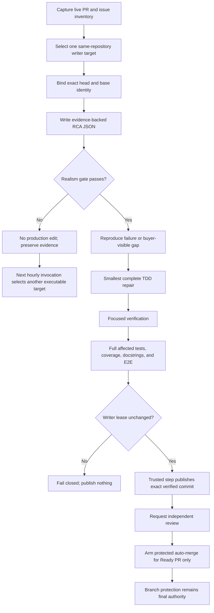

# ADR: RCA-first, realism-gated hourly commercial-readiness loop

- **Status:** Proposed
- **Date:** 2026-08-08
- **Decision owners:** ScopeWeave maintainers
- **Applies to:** Repository-managed GitHub Actions development automation

## Context

A previous autonomous maintenance attempt terminated with an unstructured reasoning/execution failure instead of converting the failure into evidence, a bounded root-cause analysis, and a recoverable next action. The operating request is larger than one ordinary CI job: it spans PR review, implementation repair, exact-head verification, protected merge disposition, product-gap discovery, documentation, and release readiness.

The prior approach was operationally unrealistic for four reasons:

1. **Unbounded scope:** it attempted to reason across too many repositories, PRs, checks, and product gaps in one execution window.
2. **No durable checkpoint:** tool failures and moving PR heads were not represented in a strict machine-readable state that a later run could verify.
3. **Missing feasibility gate:** a proposed fix could sound technically correct while depending on unavailable permissions, secrets, dependencies, external approval, or more time than the run budget.
4. **Mixed authorities:** implementation, reviewer evidence, protected merge, and release authority were discussed in one loop without a sufficiently explicit separation of duties.

Blind retry is not a correction. The loop must establish what failed, what evidence supports the causal claim, how the claim can be falsified, and whether the corrective action is executable in the live repository boundary.

## Decision

ScopeWeave will use a repository-managed workflow scheduled at minute 17 of every hour. Each invocation may own **one writer target** and must complete the following state machine:

The workflow must:

- use checksum-pinned OpenCode with `NVIDIA_NIM_API_KEY` mapped only to the NVIDIA provider process;
- never use `COPILOT_GITHUB_TOKEN` for model authentication;
- preserve the existing CodeRabbit, OpenCode-review, Noema, Strix, and security-review credential systems;
- run the model without a GitHub mutation credential;
- validate `.opencode/rca.json` before accepting changes;
- require repository scope, single-writer ownership, permissions, dependencies, test inputs, rollback, and time budget to be realistic;
- prohibit same-command blind retries and allow at most one evidence-classified transient retry;
- keep scheduled runs single-flight with `cancel-in-progress: false`, so a long OpenCode run is queued rather than killed by the next hourly trigger;
- compare the live remote head with the captured exact head immediately before publication;
- publish through a separate trusted step and arm only protected squash auto-merge, never synthesize approval or bypass protection;
- continue product-gap work only when the live PR queue does not provide a safe writer target.

## Separation of authority

| Plane | Authority | Explicit non-authority |
| --- | --- | --- |
| OpenCode implementation | Analyze, edit the checked-out worktree, run local tools, produce RCA/outcome evidence | GitHub token, push, approval, merge, release, branch protection |
| Deterministic verifier | Enforce target identity, RCA schema, protected paths, tests, coverage, docstrings, and diff safety | Model credential, review verdict, merge |
| Trusted publisher | Recheck exact writer lease, push one verified commit, create one Draft PR, request review | Execute model reasoning, approve, bypass protection |
| Independent review plane | Produce CodeRabbit/OpenCode/Noema/Strix/human review evidence | Rewrite the implementation branch through this scheduler |
| Branch protection | Decide whether protected auto-merge may execute | Infer success from queued, stale, skipped, or advisory evidence |

## Realism assessment

The design is practical under the current repository boundary because GitHub Actions supplies an hourly scheduler, non-cancelling concurrency, exact event/ref identity, job-scoped permissions, and protected auto-merge. OpenCode can run longer than one hour; the 170-minute job timeout and single-flight queue preserve accuracy without overlapping writers.

The design does **not** claim that every hourly run will merge a PR. Independent approval, external review-service availability, required checks, branch protection, and release authorization remain outside implementation authority. A run is successful when it produces verified progress or a truthful fail-closed RCA—not when it manufactures a green state.

## Consequences

### Positive

- Failed reasoning becomes auditable RCA and a concrete next action.
- Unrealistic fixes are rejected before code mutation.
- Long model latency no longer creates overlapping writers.
- Moving PR heads fail closed at publication.
- The loop can advance product work while reviews/checks settle, without mutating the same branch concurrently.
- Standalone ScopeWeave remains independent; central CWL services remain optional integrations.

### Negative

- The loop may defer work when the only valid fix requires a permission or external decision unavailable to the run.
- Full verification can exceed the hourly trigger interval; later runs queue.
- GitHub-hosted scheduler delay is not a real-time guarantee.
- Reviewer outages can leave a technically green PR open.

## Rollback

Disable or revert `.github/workflows/hourly-opencode-commercial-readiness.yml`. The workflow creates no database migration and owns no persistent runtime state. Existing PRs, review workflows, branch protection, and manual maintenance remain authoritative.

## Verification

- `python3 scripts/ci/hourly_commercial_readiness_contract.py contract --root .`
- `python3 -m unittest -v tests/config/test_hourly_commercial_readiness.py`
- repository-required workflow, security, review, and branch-protection checks on the exact PR head
- one manual `workflow_dispatch` canary after merge, with no automatic release

## References

GitHub. (2026). *Workflow syntax for GitHub Actions*. GitHub Docs. https://docs.github.com/actions/writing-workflows/workflow-syntax-for-github-actions

GitHub. (2026). *Control the concurrency of workflows and jobs*. GitHub Docs. https://docs.github.com/actions/how-tos/write-workflows/choose-when-workflows-run/control-workflow-concurrency

GitHub. (2026). *Security hardening for GitHub Actions*. GitHub Docs. https://docs.github.com/actions/security-for-github-actions/security-guides/security-hardening-for-github-actions

National Institute of Standards and Technology. (2022). *Secure software development framework (SSDF) version 1.1: Recommendations for mitigating the risk of software vulnerabilities* (NIST SP 800-218). https://doi.org/10.6028/NIST.SP.800-218

OpenCode. (2026). *CLI and provider configuration*. https://opencode.ai/docs/

NVIDIA. (2026). *NVIDIA NIM APIs*. NVIDIA Documentation. https://docs.nvidia.com/nim/
