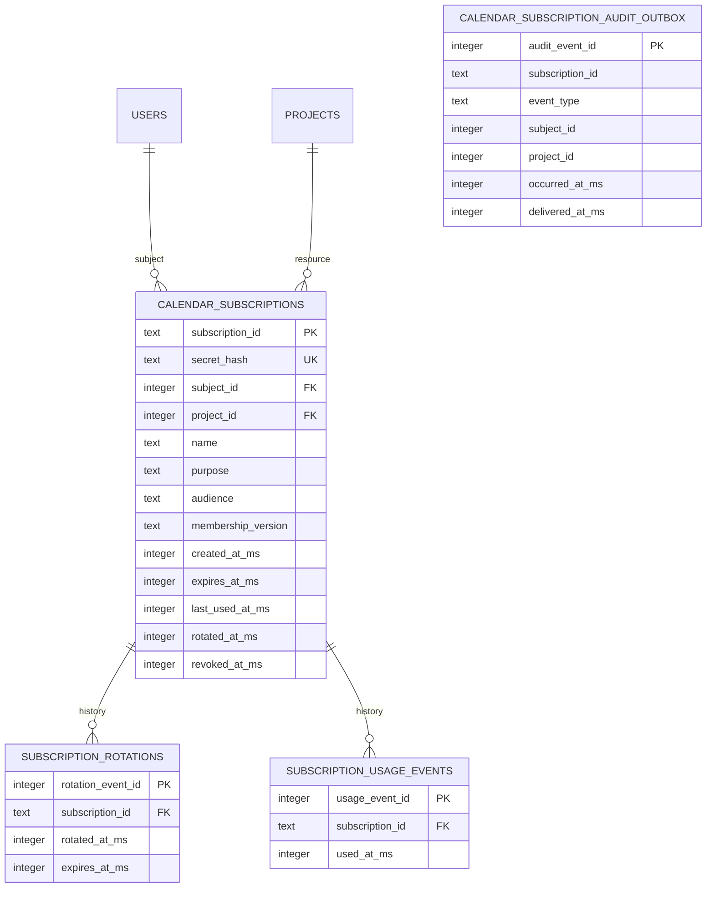

# Calendar subscription SQLite persistence — active PR doctoring record

> **Status:** Active stacked PR work only. Nothing in this document is protected-`develop` shipped truth until the complete stack is independently reviewed, satisfies the live rulesets on the unchanged integrated head, and reaches protected `develop`.
>
> **Stack:** issue #413 → access-grant domain (#506) → calendar-subscription issuance-epoch domain (#539) → SQLite persistence (#541). This slice deliberately does **not** change the protected calendar HTTP route, browser UI, deployment topology, or release version. Current #539 supplies explicit `purpose: calendar_read`; the adapter retains the omitted-purpose default only as a bounded compatibility guard for predecessor/older callers and never broadens an explicit non-calendar purpose.

## Problem and bounded outcome

The protected calendar feed still depends on a broad session credential transported in a URL. Parent PR #539 defines a separately revocable, project-bound reusable credential lifecycle and binds use to the membership epoch captured when the secret was issued, but intentionally contains no production persistence. PR #541 supplies the durable SQLite adapter needed to make that lifecycle survivable across process restarts while enforcing tenant/session revocation in the same atomic state transition that records a successful credential use.

The bounded buyer-visible value is operationally durable calendar access without storing a plaintext reusable subscription secret, while preserving immediate revocation/rotation semantics, cross-tenant nondisclosure, and lifecycle evidence that remains bounded under high-frequency feed polling. Route migration and customer-facing management UI remain later issue #413 slices and must not be represented as shipped by this PR.

## Current exact implementation boundary

`server/calendar_subscription_sqlite.mjs` owns four stable adapter surfaces:

- `installCalendarSubscriptionSchema(database)` installs normalized persistence relations and indexes at database bootstrap;
- `createSqliteCalendarSubscriptionRepository(database, options)` implements the parent-domain repository port and accepts an optional bounded `usageEventLimit`;
- `createSqliteCalendarSubscriptionAuthorizationPort(database)` verifies current project-organization membership for management actions without disclosing cross-tenant resource existence;
- `createSqliteCalendarSubscriptionMembershipPort(database)` returns an opaque live `membership_id:token_version` version used by the domain and repository to reject stale credentials.

No request handler invokes schema installation. SQLite foreign-key enforcement remains a connection/bootstrap responsibility because SQLite foreign-key enforcement is disabled by default unless enabled by the application, and changing `PRAGMA foreign_keys` within an active multi-statement transaction is ineffective. The existing server bootstrap therefore remains the correct ownership boundary for connection policy rather than this feature adapter.

## Data model and 3NF rationale

`calendar_subscriptions` is the current authorization relation. It contains one current hash and current lifecycle state only. `subscription_rotations` contains repeating lifecycle facts, while `subscription_usage_events` retains only the configured most-recent usage window; `last_used_at_ms` remains the authoritative current-use timestamp after history pruning. The audit outbox is a secret-free lifecycle-event ledger/delivery relation rather than a per-poll usage log: create, rotate, and first revoke remain durably queued, while transient `used` rows are pruned before the usage savepoint commits. `subject_id` and `project_id` are event attributes captured at occurrence time so retained lifecycle evidence does not depend on a subsequently deleted authorization row. Its lack of a foreign key to `calendar_subscriptions` is deliberate for security-event retention and retryability after resource deletion.

All owned table/index names contain multiple lexical words and use snake_case. The focused schema test executes `PRAGMA foreign_key_check` and locks exact owned-object names to prevent silent naming/normalization drift.

## Credential and tenant-security invariants

1. The one-time plaintext credential exists only at the parent-domain `create()`/`rotate()` return boundary. The SQLite adapter receives and stores only SHA-256 hashes.
2. Only the current hash remains in `calendar_subscriptions`; historical rotation, usage, and audit relations contain no secret or hash fields. Rotation therefore cannot create a credential-hash archive.
3. Calendar audience is fixed to `scopeweave:calendar` and purpose is frozen to `calendar_read`. Current #539 sends the purpose explicitly. If a predecessor/older caller omits it, the adapter supplies only `calendar_read`; an explicit non-calendar purpose is preserved for the database CHECK/authorization boundary to reject.
4. Create rechecks the domain-captured membership version inside the SQLite savepoint before inserting state.
5. Use performs a conditional update that simultaneously verifies current hash, project, purpose, audience, non-revocation, pre-expiry time, stored issuance membership epoch, and independently resolved live membership/session version before it records `last_used_at_ms` and bounded usage evidence.
6. Removing and re-adding an organization membership changes the membership-row identity. Session-wide invalidation changes `users.token_version`. Either change makes an already issued credential unusable until an authenticated operator explicitly rotates it.
7. Rotation rechecks current management authorization and live membership, replaces the sole current hash, and snapshots the fresh membership version in one savepoint. The previous secret is immediately invalid and no prior hash is retained.
8. Revocation is operator-idempotent: repeated authenticated revoke requests return the already-revoked state without duplicating the durable revocation event; `revocation_applied` is true only for the first transition.
9. Cross-tenant management is nondisclosing: unknown and inaccessible project management requests fail through the same parent-domain not-found boundary.

This credential is ScopeWeave-specific and must **not** be represented as an OAuth access token. RFC 9700 is used as current threat/least-privilege evidence—particularly its guidance to reduce bearer-token exposure and applicability—not as a claim of protocol conformance.

## Transaction and evidence design

Repository transitions use named SQLite `SAVEPOINT` / `ROLLBACK TO` / `RELEASE` boundaries rather than unconditional `BEGIN`/`COMMIT`. SQLite documents that savepoints may be nested within an existing transaction and that `ROLLBACK TO` rewinds state without cancelling the outer transaction. This lets the adapter compose safely with a future wider request/outbox transaction instead of failing because nested `BEGIN` transactions are unsupported.

Create, rotate, and first revoke write durable lifecycle state plus `calendar_subscription_audit_outbox` evidence inside the same savepoint. Successful use updates `last_used_at_ms`, appends then prunes bounded `subscription_usage_events`, performs the existing transactional outbox write check, and prunes read-only `used` outbox rows before commit so calendar polling cannot create an unbounded delivery backlog. A test-installed trigger forces the transient outbox write to fail during use and verifies that `last_used_at_ms` and `subscription_usage_events` both roll back. This preserves executable failure-mode evidence for the “state and evidence together” transaction contract while keeping durable outbox backlog lifecycle-only.

Outbox delivery itself is intentionally outside this slice. A later worker may mark lifecycle rows `delivered_at_ms`; deterministic authorization never depends on model judgement or outbox-delivery availability.

## TDD and acceptance evidence

The original predecessor line began with a test-only head that imported the absent `server/calendar_subscription_sqlite.mjs`; its hosted Server Tests failed RED with `ERR_MODULE_NOT_FOUND`, demonstrating that production implementation was required. Subsequent predecessor runs exercised the implemented adapter and focused SQLite scenarios, but that historical evidence is not merge authorization for current #541.

The old #524 Server Tests also checked out a synthetic `refs/pull/524/merge` revision rather than its contributor head. That evidence remains historical only. PR #523 addresses the repository workflow checkout defect; exact-current-head evidence must be regenerated for the retargeted #541 head and no predecessor/synthetic success transfers.

During current stack reconciliation, #541 was rebuilt so the effective tree is the exact #539 parent plus the SQLite adapter/docs/tests/coverage registration only. A fresh comparison after reconstruction showed zero commits behind #539 and no parent source/test/documentation regression in the effective diff. Retargeting #541 directly to the #539 head branch therefore makes dependency order explicit instead of relying on a stale sibling base.

Focused acceptance coverage includes:

- hash-only durable create and safe list metadata;
- repeat authorization for the correct project before expiry and exact-expiry rejection;
- token-version revocation and membership remove/re-add invalidation;
- authenticated rotation after session-version change while the old secret remains invalid;
- omitted-purpose compatibility default plus explicit wrong-purpose rejection;
- absence of secrets/hashes from rotation, usage, and audit history relations;
- first-transition-only revocation evidence and idempotent repeated revoke;
- cross-tenant management nondisclosure;
- file-backed reopen/process-survival behavior;
- transactional rollback when the usage transition cannot write its outbox evidence;
- bounded recent-use retention under repeated polling with no durable `used` outbox backlog;
- schema naming, normalized history relations, and foreign-key integrity;
- race coverage for membership/rotation/use transitions.

The canonical unit and c8 commands include `server/calendar_subscription_sqlite.mjs` plus the persistence, expiry, retention, race, and issuance-epoch suites. Exact 100% statement/branch/function/line evidence remains mandatory before this PR can be considered integration-ready; an ordinary unit-test GREEN run does not substitute for that measurement.

## Traceability

| Requirement / risk | Executable evidence | Implementation boundary | Status |
| --- | --- | --- | --- |
| Reusable calendar secret is never plaintext at rest | hash-only persistence/list assertions | `calendar_subscriptions.secret_hash` | Active PR #541 |
| Old secret is unusable after rotation | old/new authorization regression | `rotateSubscriptionAtomically` | Active PR #541 |
| Logout-all/session revocation invalidates subscription | `token_version` mutation regression | membership version + atomic use SQL | Active PR #541 |
| Membership removal/re-add does not revive old credential | membership-row replacement regression | opaque `membership_id:token_version` | Active PR #541 |
| Wrong or broader purpose cannot authorize | explicit wrong-purpose regressions + SQL CHECK | `purpose = calendar_read` | Active PR #541 |
| Cross-tenant project existence is not disclosed | other-tenant list/rotate regression | authorization port + parent domain mapping | Active PR #541 |
| State and usage evidence roll back together on write failure | forced-outbox-failure rollback regression | usage savepoint transaction | Active PR #541 |
| Frequent polling does not create unbounded durable evidence | bounded-retention regression | `usageEventLimit` + usage/outbox pruning | Active PR #541 |
| Durable credential survives process restart | file-backed SQLite reopen regression | SQLite repository | Active PR #541 |
| History contains no credential material | schema introspection assertions | rotation/usage/audit relations | Active PR #541 |
| DB object naming and referential integrity | exact object list + `foreign_key_check` | schema installer | Active PR #541 |
| Exact-head CI evidence | current contributor SHA and exact current base required | repository/organization workflows | Regenerating after current-head mutation; predecessor evidence non-passing |
| Independent current-head approval | qualifying independent reviewer after latest push | protected branch/ruleset governance | Required before integration |
| Calendar route no longer consumes broad session JWT | future API migration | `server/app.mjs` | Planned / out of this slice |
| Customer can create/copy/rotate/revoke subscription in UI | future implementation matching issue #413 interaction contract | browser client | Planned / out of this slice |

## Rollback and recovery

Before route integration, rollback of this slice consists of removing the SQLite adapter, focused tests, coverage registrations, doctoring entry, and changelog line together. Because no protected route or protected schema migration consumes these relations yet, that rollback creates no production credential downtime.

After a future route migration, rollback must never restore the broad session-JWT query credential as a “safe” steady state. Durable revocation/rotation/audit history must be retained according to the future retention policy, and credential material must not be reconstructed from logs or history.

## References

Lodderstedt, T., Bradley, J., Labunets, A., & Fett, D. (2025). *Best current practice for OAuth 2.0 security* (RFC 9700; BCP 240). RFC Editor. https://doi.org/10.17487/RFC9700

SQLite. (n.d.). *Savepoints*. Retrieved August 16, 2026, from https://sqlite.org/lang_savepoint.html

SQLite. (2026, February 18). *Transaction*. https://sqlite.org/lang_transaction.html

SQLite. (n.d.). *SQLite foreign key support*. Retrieved August 16, 2026, from https://www.sqlite.org/foreignkeys.html
