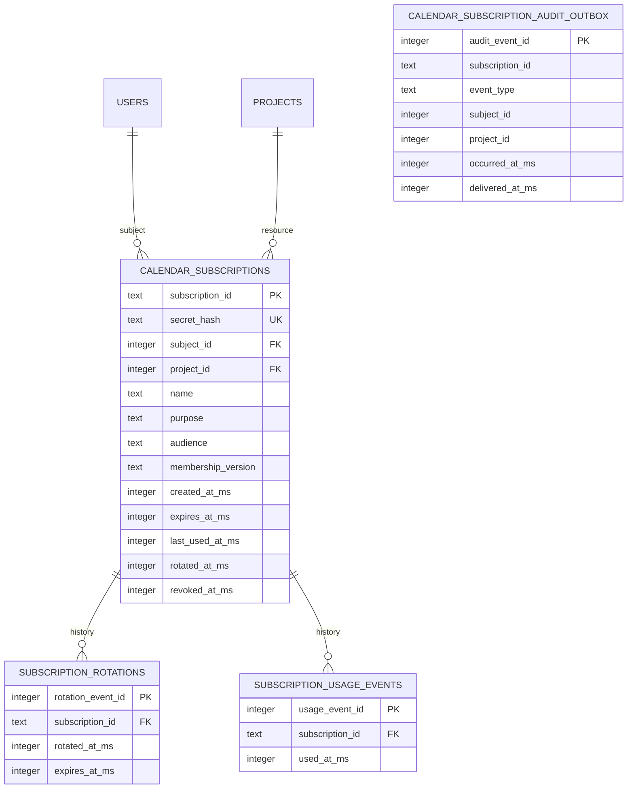

# Calendar subscription SQLite persistence — active PR doctoring record

> **Status:** Active stacked PR work only. Nothing in this document is protected-`develop` shipped truth until the complete stack is independently reviewed, satisfies the live rulesets on the unchanged integrated head, and reaches protected `develop`.
>
> **Stack:** issue #413 → access-grant domain (#506) → calendar-subscription domain (#514, with issuance-epoch landing #539) → SQLite persistence (#524). This slice deliberately does **not** change the protected calendar HTTP route, browser UI, deployment topology, or release version. The parent domain on #514 still emits audience without `purpose`; this adapter freezes `calendar_read` at rest so a later domain rebase can send the field explicitly without a schema change.

## Problem and bounded outcome

The protected calendar feed still depends on a broad session credential transported in a URL. The parent calendar-subscription domain (#514) defines a separately revocable, project-bound reusable credential lifecycle, but intentionally contains no production persistence. PR #524 supplies the durable SQLite adapter needed to make that lifecycle survivable across process restarts and enforce tenant/session revocation at the same atomic state transition that records a successful credential use.

The bounded buyer-visible value is operationally durable calendar access without storing a plaintext reusable subscription secret, while preserving immediate revocation/rotation semantics, cross-tenant nondisclosure, and immutable lifecycle evidence. Route migration and customer-facing management UI remain later slices and must not be represented as shipped by this PR.

## Current exact implementation boundary

`server/calendar_subscription_sqlite.mjs` owns four stable adapter surfaces:

- `installCalendarSubscriptionSchema(database)` installs normalized persistence relations and indexes at database bootstrap;
- `createSqliteCalendarSubscriptionRepository(database)` implements the parent domain repository port;
- `createSqliteCalendarSubscriptionAuthorizationPort(database)` verifies current project-organization membership for management actions without disclosing cross-tenant resource existence;
- `createSqliteCalendarSubscriptionMembershipPort(database)` returns an opaque live `membership_id:token_version` version used by the domain and repository to reject stale credentials.

No request handler invokes schema installation. SQLite foreign-key enforcement remains a connection/bootstrap responsibility because SQLite foreign-key enforcement is disabled by default unless enabled by the application, and changing `PRAGMA foreign_keys` within an active multi-statement transaction is ineffective. The existing server bootstrap therefore remains the correct ownership boundary for connection policy rather than this feature adapter.

## Data model and 3NF rationale

`calendar_subscriptions` is the current authorization relation. It contains one current hash and current lifecycle state only. `subscription_rotations` and `subscription_usage_events` contain independent repeating event facts, preventing repeating groups or history arrays in the authorization row. The audit outbox is an immutable security-event ledger/delivery relation rather than a copy of current authorization state: `subject_id` and `project_id` are intentionally event attributes captured at occurrence time so retained evidence does not depend on a subsequently deleted authorization row. Its lack of a foreign key to `calendar_subscriptions` is deliberate for security-event retention and retryability after resource deletion.

All owned table/index names contain multiple lexical words and use snake_case. The focused schema test also executes `PRAGMA foreign_key_check` and locks exact owned-object names to prevent silent naming/normalization drift.

## Credential and tenant-security invariants

1. The one-time plaintext credential exists only at the parent domain `create()`/`rotate()` return boundary. The SQLite adapter receives and stores only SHA-256 hashes.
2. Only the current hash remains in `calendar_subscriptions`; historical rotation, usage, and audit relations contain no secret or hash fields. Rotation therefore cannot create a credential-hash archive.
3. Calendar audience is fixed to `scopeweave:calendar` and purpose is frozen to `calendar_read`. A parent domain that still omits `purpose` receives that frozen value at the persistence boundary; an explicit non-calendar purpose cannot authorize or persist.
4. Create rechecks the domain-captured membership version inside the SQLite savepoint before inserting state.
5. Use performs a conditional update that simultaneously verifies current hash, project, audience, non-revocation, pre-expiry time, stored membership-version snapshot, and independently resolved live membership/session version before it records `last_used_at_ms` and usage evidence.
6. Removing and re-adding an organization membership changes the membership-row identity. Session-wide invalidation changes `users.token_version`. Either change makes an already issued credential unusable until an authenticated operator explicitly rotates it.
7. Rotation rechecks current management authorization and live membership, replaces the sole current hash, and snapshots the fresh membership version in one savepoint. The previous secret is immediately invalid and no prior hash is retained.
8. Revocation is operator-idempotent: repeated authenticated revoke requests return the already-revoked state without duplicating the durable revocation event.
9. Cross-tenant management is nondisclosing: unknown and inaccessible project management requests fail through the same parent-domain not-found boundary.

This credential is ScopeWeave-specific and must **not** be represented as an OAuth access token. RFC 9700 is used as current threat/least-privilege evidence—particularly its guidance to reduce bearer-token exposure and applicability—not as a claim of protocol conformance.

## Transaction and evidence design

Repository transitions use named SQLite `SAVEPOINT` / `ROLLBACK TO` / `RELEASE` boundaries rather than unconditional `BEGIN`/`COMMIT`. SQLite documents that savepoints may be nested within an existing transaction and that `ROLLBACK TO` rewinds state without cancelling the outer transaction. This lets the adapter compose safely with a future wider request/outbox transaction instead of failing because nested `BEGIN` transactions are unsupported.

For create, successful use, rotate, and first revoke, lifecycle state and `calendar_subscription_audit_outbox` evidence are written inside the same savepoint. A test-installed trigger forces an outbox write failure during use and verifies that `last_used_at_ms` and `subscription_usage_events` both roll back. This is the executable failure-mode evidence for the “state and durable evidence together” contract rather than an assertion-only transaction test.

Outbox delivery itself is intentionally outside this slice. A later worker may mark `delivered_at_ms`; deterministic authorization never depends on model judgement or outbox-delivery availability.

## TDD and acceptance evidence

The initial test-only head imported the absent `server/calendar_subscription_sqlite.mjs`. The hosted Server Tests run failed with `ERR_MODULE_NOT_FOUND`, demonstrating that production implementation was required before the persistence contract could pass. After the adapter was added, all ten focused SQLite behavior scenarios passed together with the repository unit/API suite and cloud browser E2E in the observed hosted run.

However, those Server Tests currently check out GitHub's synthetic `refs/pull/524/merge` SHA rather than the contributor head. The observed GREEN checkout was synthetic merge `086f0e972e858264eae0dbd88091b476d9547cda`, produced from contributor head `7f667689b237e0910d99f47bfce63e6a267d2a85` over parent `cf12559739cc3161000e6e6dedfe9370033acb7a`. Under ScopeWeave's quality contract, synthetic/predecessor evidence is explicitly non-passing. PR #523/#522 addresses that workflow defect; #524 cannot promote this run to exact-head merge evidence.

Focused acceptance coverage includes:

- hash-only durable create and safe list metadata;
- repeat authorization for the correct project before expiry and exact-expiry rejection;
- token-version revocation and membership remove/re-add invalidation;
- authenticated rotation after session-version change while the old secret remains invalid;
- absence of secrets/hashes from rotation, usage, and audit history relations;
- idempotent revocation with one durable revoke event;
- cross-tenant management nondisclosure;
- file-backed reopen/process-survival behavior;
- transactional rollback when durable audit evidence cannot be written;
- schema naming, normalized history relations, and foreign-key integrity.

The canonical c8 command includes `server/calendar_subscription_sqlite.mjs` and the focused persistence test. Exact 100% statement/branch/function/line evidence remains mandatory before this PR can be considered integration-ready; a normal unit-test GREEN run does not substitute for that measurement.

## Traceability

| Requirement / risk | Executable evidence | Implementation boundary | Status |
| --- | --- | --- | --- |
| Reusable calendar secret is never plaintext at rest | hash-only persistence/list assertions | `calendar_subscriptions.secret_hash` | Active PR |
| Old secret is unusable after rotation | old/new authorization regression | `rotateSubscriptionAtomically` | Active PR |
| Logout-all/session revocation invalidates subscription | `token_version` mutation regression | membership version + atomic use SQL | Active PR |
| Membership removal/re-add does not revive old credential | membership-row replacement regression | opaque `membership_id:token_version` | Active PR |
| Cross-tenant project existence is not disclosed | other-tenant list/rotate regression | authorization port + parent domain mapping | Active PR |
| State and audit evidence cannot diverge on write failure | forced-outbox-failure rollback regression | savepoint transaction | Active PR |
| Durable credential survives process restart | file-backed SQLite reopen regression | SQLite repository | Active PR |
| History contains no credential material | schema introspection assertions | rotation/usage/audit relations | Active PR |
| DB object naming and referential integrity | exact object list + `foreign_key_check` | schema installer | Active PR |
| Exact-head CI evidence | must execute contributor SHA, not PR merge ref | repository workflow ownership | Blocked on #523/#522 integration |
| Independent current-head approval | qualifying independent reviewer after latest push | protected branch/ruleset governance | External governance prerequisite |
| Calendar route no longer consumes broad session JWT | future API migration | `server/app.mjs` | Planned / out of this slice |
| Customer can create/copy/rotate/revoke subscription in UI | future implementation matching Figma contract from #514 | browser client | Planned / out of this slice |

## Rollback and recovery

Before route integration, rollback of this slice consists of removing the SQLite adapter, focused tests, coverage registrations, doctoring entry, and changelog line together. Because no protected route or protected schema migration consumes these relations yet, that rollback creates no production credential downtime.

After a future route migration, rollback must never restore the broad session-JWT query credential as a “safe” steady state. Durable revocation/rotation/audit history must be retained according to the future retention policy, and credential material must not be reconstructed from logs or history.

## References

Lodderstedt, T., Bradley, J., Labunets, A., & Fett, D. (2025). *Best current practice for OAuth 2.0 security* (RFC 9700; BCP 240). RFC Editor. https://doi.org/10.17487/RFC9700

SQLite. (n.d.). *Savepoints*. Retrieved August 16, 2026, from https://sqlite.org/lang_savepoint.html

SQLite. (2026, February 18). *Transaction*. https://sqlite.org/lang_transaction.html

SQLite. (n.d.). *SQLite foreign key support*. Retrieved August 16, 2026, from https://www.sqlite.org/foreignkeys.html
