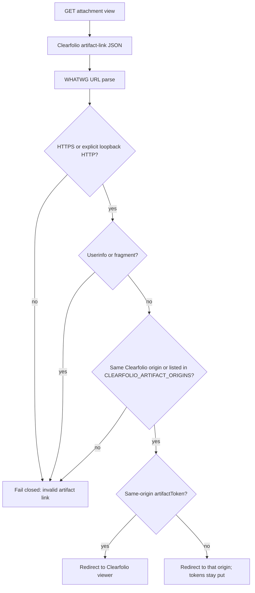

# Clearfolio artifact-origin allowlist

## Decision

Attachment view is a browser 302 to a provider-returned artifact URL. ScopeWeave therefore treats that URL as an untrusted redirect target even after the Clearfolio origin, HMAC, transport, and JSON-response boundaries have passed.

A returned link is accepted only when:

1. it parses as an absolute URL against the configured Clearfolio origin;
2. its scheme is HTTPS, or HTTP only when both the provider and the link are explicit development-mode loopback HTTP;
3. it has no userinfo and no fragment;
4. its origin is either the configured Clearfolio origin or an origin listed in `CLEARFOLIO_ARTIFACT_ORIGINS`.

Same-origin `artifactToken` values may still be rewritten into the trusted Clearfolio viewer route. Tokens on an allowlisted CDN stay on that CDN and are never copied into the viewer host. An empty allowlist means only the configured Clearfolio origin is trusted, so a planner cannot be sent to an unreviewed host by a confused or compromised provider response.

This slice does not invent a second wire protocol. It only constrains which returned URLs ScopeWeave will hand to the browser. Retry, idempotency, and the remaining Clearfolio lifecycle work stay on issue #489.

## Operator action

To serve converted documents from a reviewed CDN or object-storage origin, set `CLEARFOLIO_ARTIFACT_ORIGINS` to a comma-separated list of absolute origin URLs such as `https://cdn.example,https://files.example:8443`. Leave the setting empty to keep viewing on the Clearfolio origin only. If a planner sees `clearfolio artifact-link response invalid` after a successful conversion, add the reviewed origin or keep the file on the Clearfolio host; do not disable the check at a proxy.

Unsafe allowlist entries fail closed with `clearfolio_artifact_origins_invalid` and tell the operator to correct the origin list. Credentials, paths, query strings, fragments, and remote HTTP are rejected in the allowlist itself so the setting cannot become an arbitrary request prefix.

## Verification contract

`tests/unit/clearfolio-artifact-origin.test.mjs` proves:

- tokenless cross-origin links fail without an allowlist;
- userinfo and fragments never become redirect targets, even when the host is listed;
- same-origin relative and token-bearing viewer links still work with an empty allowlist;
- listed CDN origins may be returned, and their tokens stay on that origin;
- unlisted CDN origins and malformed allowlist entries fail closed.

`tests/unit/clearfolio-status-signal.test.mjs` now expects the predecessor `https://cdn.example/file.pdf` fixture to fail closed unless that origin is reviewed. The adapter remains an owned c8 production target.

## Security rationale

OWASP's SSRF guidance treats attacker-controlled complete URLs and open redirects as bypass paths around host validation. Attachment view is a user-facing redirect, so the same allowlist discipline applies before the 302 is issued. The WHATWG URL Standard supplies the component model (origin, userinfo, fragment) used for exact comparison instead of string-prefix checks. OWASP API10:2023 continues to classify unvalidated third-party data as unsafe API consumption.

## Rollback

Rollback reverts the allowlist parser, artifact-link origin/credential/fragment checks, the new and adapted unit regressions, test registrations, deployment and API guidance, this doctoring record, and the CHANGELOG entry together. No database schema or persisted attachment representation changes in this slice.

## References

OWASP Foundation. (2023). *API10:2023 unsafe consumption of APIs*. OWASP API Security Top 10. https://owasp.org/API-Security/editions/2023/en/0xaa-unsafe-consumption-of-apis/

OWASP Foundation. (n.d.). *Server Side Request Forgery Prevention Cheat Sheet*. OWASP Cheat Sheet Series. https://cheatsheetseries.owasp.org/cheatsheets/Server_Side_Request_Forgery_Prevention_Cheat_Sheet.html

WHATWG. (2026). *URL Standard*. https://url.spec.whatwg.org/
