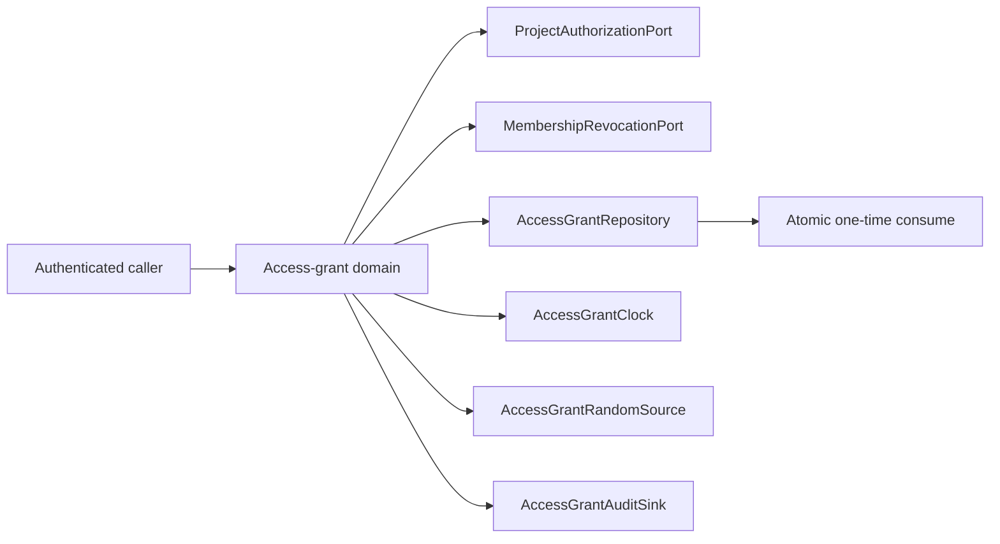

# Short-lived access-grant domain: evidence and design record

## Status and bounded scope

This record describes active pull-request work for issue #413. It is **not
protected-`develop` shipped truth** until the corresponding pull request merges.
The bounded slice establishes only the framework-neutral short-lived grant
policy and repository contract used later by HTTP and persistence adapters.

This slice deliberately does **not** yet:

- replace the existing session JWT query-string transports;
- add the authenticated grant exchange route;
- create SQLite or PostgreSQL grant tables;
- integrate SSE, attachment-view, or calendar clients;
- implement long-lived calendar-subscription secrets, rotation, or UI; or
- claim issue #413 is complete.

Those operations need separately reviewable migrations, route adapters,
revocation hooks, browser acceptance tests, and recovery evidence.

## Threat and decision

A general session bearer token in a URI has more authority and a longer lifetime
than an SSE bootstrap or one attachment view requires. URI credentials may also
appear in browser history, reverse-proxy/access logs, observability systems,
copied URLs, screenshots, and incident artifacts. RFC 6750 therefore discourages
URI query transport because of its logging exposure, while RFC 9700 states that
OAuth clients must not pass access tokens in URI query parameters.

Where a browser mechanism still requires URL-carried authority, ScopeWeave will
move toward a narrowly scoped opaque credential rather than another
resource-general JWT. The current domain slice implements two short-lived
purposes:

- `stream` with audience `scopeweave:stream`; and
- `attachment_view` with audience `scopeweave:attachment-view` and one required
  attachment identifier.

Both have a hard maximum lifetime of 300 seconds. Calendar subscription
credentials are excluded because a long-lived subscription needs an independent
secret lifecycle, rotation, usage metadata, and user-facing revocation policy.

## Ports and authority boundary

The domain depends on explicit ports instead of Hono, SQLite, Clearfolio, or a
browser implementation:

Required repository methods are `insertGrant`, `findGrantByHash`, and
`consumeGrantAtomically`. The eventual SQLite and PostgreSQL adapters must run
the same repository contract. The repository—not the HTTP framework—owns the
atomic state transition that makes concurrent one-time consumption yield at
most one success.

## Security invariants

The implementation enforces these invariants before route integration:

1. Secrets contain 32 random bytes encoded with unpadded base64url. The random
   source must return an actual 32-byte `Uint8Array`.
2. Only a SHA-256 token hash is passed to persistence; plaintext grant secrets
   are never part of stored records or audit events.
3. Purpose and audience are fixed pairs rather than caller-extensible strings.
4. Stream grants cannot carry an attachment identifier; attachment-view grants
   require exactly one bound attachment identifier.
5. Project authorization is checked before minting. An authorization failure is
   intentionally represented by a generic not-authorized result suitable for a
   tenant-nondisclosing route response.
6. Membership activity is checked again before redemption so a grant cannot
   blindly outlive membership removal.
7. Redemption requires an exact secret shape plus purpose, audience, project,
   and attachment binding. Missing, malformed, expired, used, revoked, wrong-
   resource, or otherwise unusable grants collapse to the same unauthorized
   result.
8. Time values and expiry arithmetic must be non-negative safe integers. Exact
   expiry is non-usable (`now >= expires_at`).
9. Successful redemption depends on the repository's atomic consume operation;
   read-then-write consumption in a route adapter is not compliant.
10. Audit metadata may contain grant identifiers and bound resource metadata,
    but never the plaintext secret or token hash.

The generated `grant_id` is an operational correlation identifier, not a bearer
credential. It uses an independent 16 random bytes and is never derived from the
secret or its token hash, so audit correlation does not disclose token-hash
material.

## Persistence contract for follow-up adapters

No database object is added in this slice. Follow-up persistence work must use
3NF and descriptive two-or-more-word `snake_case` object names, including the
issue-defined `access_grants`, `grant_consumptions`, and `grant_revocations`
objects where those responsibilities remain distinct. The adapter must make
expiry/revocation/use predicates and the first successful consumption one
transactionally atomic transition. A stale read followed by an unconditional
update is not sufficient.

The adapter must also preserve hash-only storage across restart and prove that
schema migration, rollback, and recovery keep schema generation and grant state
consistent.

## TDD and acceptance evidence

The first contract commit intentionally imported the absent
`server/access_grant_domain.mjs`; Node returned `ERR_MODULE_NOT_FOUND`, providing
the RED evidence before implementation. The production module was added only
after the behavior and coverage registrations were committed.

Focused contract tests cover:

- dependency-port validation;
- 32-byte opaque-token generation and hash-only persistence;
- independently random non-secret grant identifiers;
- secret/hash exclusion from audit events;
- fixed purpose/audience/resource binding;
- maximum and exact TTL boundaries;
- inaccessible-project and revoked-membership behavior;
- malformed and unknown secrets;
- exact-expiry rejection;
- one-time replay rejection; and
- two concurrent redemption attempts producing exactly one success through the
  repository's atomic consume contract.

The production source is registered explicitly in the repository `c8` producer,
and the coverage-registration contract prevents it from silently dropping out.
A focused Node V8 coverage run on the implementation source produced 100%
statement/line, branch, and function coverage before the independent-ID hardening;
hosted current-head coverage is authoritative for the resulting head.

## Rollback and compatibility

This slice has no route, schema, migration, session-token, Clearfolio, or browser
behavior change. Rollback therefore removes the domain module, its contract and
edge tests, coverage registrations, this record, and the matching changelog
entry together. Existing protected behavior is unchanged until a later route
integration explicitly migrates a transport.

## References

Jones, M. B., & Hardt, D. (2012). *The OAuth 2.0 authorization framework:
Bearer token usage* (RFC 6750). Internet Engineering Task Force.
https://doi.org/10.17487/RFC6750

Lodderstedt, T., Bradley, J., Labunets, A., & Fett, D. (2025). *Best current
practice for OAuth 2.0 security* (BCP 240; RFC 9700). Internet Engineering Task
Force. https://doi.org/10.17487/RFC9700

Sheffer, Y., Hardt, D., & Jones, M. (2020). *JSON Web Token best current
practices* (BCP 225; RFC 8725). Internet Engineering Task Force.
https://doi.org/10.17487/RFC8725
