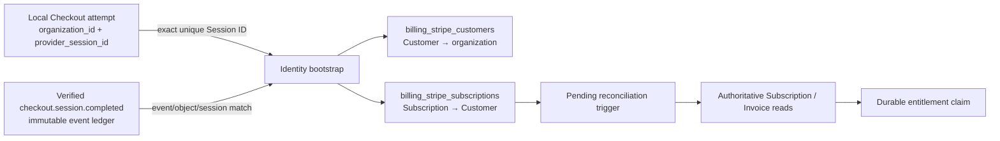

# Stripe Checkout tenant-identity bootstrap

## Status boundary

This document describes active stacked work on `feat/stripe-checkout-identity-bootstrap-488`. It is **not protected-`develop` shipped truth** until the owning pull request and its prerequisite Stripe lifecycle stack integrate under the live ruleset. The parent slice queues verified provider events for later authoritative reconciliation; this child closes the missing first-subscription tenant-identity bootstrap needed before that reconciliation can resolve a ScopeWeave organization without trusting webhook metadata as authority.

## Buyer and integrity problem

The authoritative Subscription reader and reconciliation service deliberately require an expected ScopeWeave organization before accepting provider state. That fail-closed rule creates a bootstrap question for a newly purchased subscription: the first verified Subscription/Invoice event can name a Stripe Subscription, but it must not be allowed to choose the local organization by mutable metadata or arrival order.

ScopeWeave already has a stronger server-owned anchor. A successful Checkout attempt records both its local `organization_id` and the exact Stripe Checkout `provider_session_id`. Stripe documents that a successfully completed Checkout Session contains Customer and, in subscription mode, Subscription references, and that successful completion emits `checkout.session.completed`. The bootstrap therefore joins the cryptographically verified Checkout Session event to one unique local successful attempt by the exact Session ID before persisting Customer/Subscription identity.

## Authority chain

The signed event supplies provider identities, but the local successful attempt supplies tenant authority. Neither source is sufficient by itself. The event ledger must independently agree on event type, Checkout object type, and Session ID. Exactly one successful local attempt must own that Session ID.

## Fail-closed rules

- Only `checkout.session.completed` whose object is a `checkout.session` in `subscription` mode is eligible.
- Session, Customer, and Subscription identities must be bounded canonical provider identifiers; expanded objects or malformed identities are rejected in this slice rather than guessed.
- The verified event ledger row must exist and match the exact Session ID and object/event type.
- Zero successful local attempts for the Session fails as unmatched authority; two or more fail as ambiguous authority.
- An existing Customer can only remain bound to the same organization; an existing Subscription can only remain bound to the same Customer.
- Exact replay of the same verified binding is idempotent and does not rewrite first-observed time.
- The bootstrap never writes `orgs.plan`, entitlement claims, sessions, membership, or RBAC authority.

## Atomicity and recovery

The event recorder already owns an outer SQLite savepoint covering verified event evidence and reconciliation-trigger creation. This slice installs the normalized Customer/Subscription schema before recorder configuration, executes identity bootstrap inside that same outer savepoint, and then queues the trigger. The bootstrap itself uses a nested savepoint. A failure in Customer/Subscription binding or later trigger creation therefore rolls the event delivery, immutable event fact, identity rows, and trigger back together.

SQLite documents that nested savepoints remain reversible by an enclosing rollback and that `ROLLBACK TO` rewinds changes after the savepoint while keeping the savepoint active until release. Cleanup releases only after rollback is confirmed; a cleanup failure does not replace the causal error.

## Verification and traceability

The focused behavior regression covers successful tenant bootstrap, exact replay, event/session mismatch, missing verified event, wrong event type, duplicate successful local Session ownership, cross-tenant Customer/Subscription rebinding, malformed or expanded identities, plan non-mutation, and a real SQLite trigger-induced second-write failure proving Customer and Subscription inserts roll back together.

The production webhook integration regression uses the real bootstrapped `server/db.mjs` recorder path. It proves verified `checkout.session.completed` creates normalized tenant identity before pending reconciliation work and proves a forced identity-write failure removes the verified event, delivery, identity rows, and trigger together. `package.json`, the focused package contract, and the canonical coverage contract register the production module and regression in normal unit and c8 execution.

## Rollback

Before protected integration, rollback removes the bootstrap module/tests and restores the parent recorder ordering/extraction. After integration, rollback must preserve any already-created Customer/Subscription identity rows as historical provider identity unless an operator proves they were incorrectly bound; deleting durable identity as part of code rollback would discard audit evidence. No automatic plan or entitlement reversal is required because this slice never changes access authority.

## References

SQLite Consortium. (2026). *Savepoints*. SQLite. https://www.sqlite.org/lang_savepoint.html

Stripe. (2026). *Checkout Sessions*. Stripe API Reference. https://docs.stripe.com/api/checkout/sessions

Stripe. (2026). *The Checkout Session object*. Stripe API Reference. https://docs.stripe.com/api/checkout/sessions/object

Stripe. (2026). *Types of events*. Stripe API Reference. https://docs.stripe.com/api/events/types

Stripe. (2026). *Fulfill orders*. Stripe Documentation. https://docs.stripe.com/checkout/fulfillment
