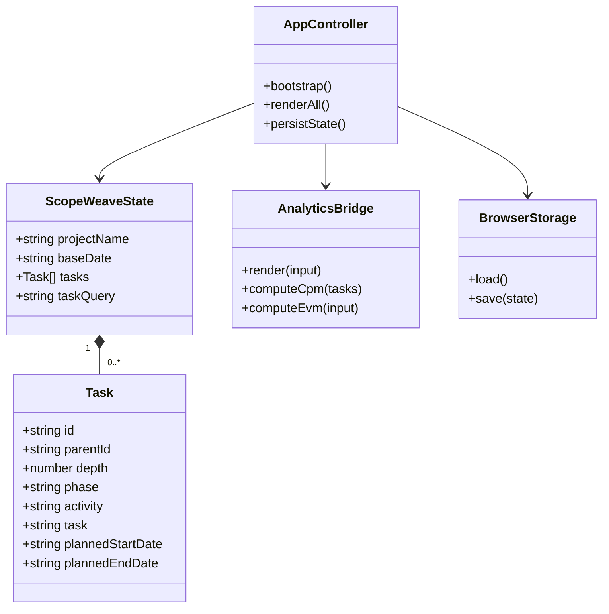

# ScopeWeave 제품·기술 Gap Baseline

> 기준일: 2026-08-29  |  보호 기준 브랜치: `develop`  |  보호 기준 HEAD: `2c328875e00e86537df3e965170be80532571cad`

이 문서는 저장소의 PRD 역할을 하는 설계 문서와 README, 기술 계약,
구현·테스트·운영 게이트를 현재 파일과 실행 증거에 연결하는 기준선이다.
별도 `PRD.md`는 없으며, 제품 요구의 원문은
[`docs/plans/2026-04-20-scopeweave-design.md`](plans/2026-04-20-scopeweave-design.md)와
[`README.md`](../README.md)이다. 아래의 “완료”는 보호된 `develop`에 실제로
존재하는 것만 뜻한다. 열린 PR의 구현은 별도 제출 상태로 기록한다.

## 1. 제품 목표와 구매자

주 구매자는 일정·공정 데이터를 WBS로 관리하고 계획 대비 실적과 지연
원인을 설명해야 하는 PM과 PMO다. 제품의 핵심 가치는 다음과 같다.

1. `단계 > Activity > Task` 구조를 빠르게 편집한다.
2. 날짜·진척·선행작업에서 일정 통제 신호를 재현 가능하게 계산한다.
3. CSV와 브라우저 저장으로 별도 플랫폼에서도 계획을 회수한다.

현재 제품은 정적 브라우저 클라이언트와 선택적 Node SaaS 계층으로 나뉜다.
정적 호스팅에서 서버 파일을 덮어쓰지 않는 제약은 유지한다.

## 2. PRD/TRD 추적성

| 요구 | 보호된 `develop` 구현 증거 | 상태 |
| --- | --- | --- |
| 3단계 WBS 편집·계층 보존 | `app.js`의 단일 `state.tasks`, `renderAll()`, expand/collapse·subtree 이동 | 완료 |
| 계획/실적 진척 및 일정 통제 | `analytics.js`의 EVM, S-curve, CPM, workload | 완료 |
| 작업 검색과 계층 맥락 유지 | 현재 `develop`에는 미포함. #621의 `5c6c2530` 현재 제출본에 구현됨 | 제출됨, 병합 대기 |
| CSV 왕복 | `exportCsv()`, CSV parser/validation, E2E·fuzz 계약 | 완료 |
| JSON seed·localStorage·선택적 파일 sync | `loadSeedTasks()`, `localStorage`, `exportJsonArray()`, File System Access API | 완료 |
| 명시적 JSON 다운로드 | 현재 `develop` UI에는 없음. #621의 `5c6c2530` 현재 제출본에 구현됨 | 제출됨, 병합 대기 |
| 첫 방문 샘플 안내와 빈 계획 전환 | 현재 `develop`에는 미포함. #624 변경이 포함된 #621 `5c6c2530` 제출본 | 제출됨, 병합 대기 |
| 정적 배포 | `pages.yml`, 상대 경로 자산, `404.html`; GitHub Pages 성공 배포 `develop@2c328875`와 공개 응답 확인 (`https://contextualwisdomlab.github.io/scopeweave/`) | 완료 |
| Cloud 인증·멀티테넌시·협업 | `server/`, `cloud-sync.js`, API smoke/E2E | 코드·테스트 존재, 운영 환경 검증 필요 |

## 3. UML 및 데이터 흐름

`tasks`가 유일한 원천이며 사용자 입력·파일 seed·Cloud snapshot은 이 상태로
정규화된다. 화면 갱신은 `renderAll()` 하나를 통과하고 분석은
`window.ScopeWeaveAnalytics` 경계를 통해 호출된다.

## 4. 현재 PR 및 Gap 조치 상태

이 표는 2026-08-29의 GitHub exact-head snapshot이다. Checks와 리뷰는
HEAD가 바뀌면 다시 확인해야 한다.

| ID | Gap / 고객 영향 | 현재 제출 상태 | 조치 |
| --- | --- | --- | --- |
| G-01 | 큰 WBS에서 작업 위치를 찾는 비용 | #621 `5c6c2530`, `develop` 병합 대기 | 작업·담당자·산출물 등 필드 검색과 상위 계층 표시 |
| G-02 | 정적 사용자가 JSON을 회수하려면 파일 API에 의존 | #621 `5c6c2530`, `develop` 병합 대기 | 브라우저 JSON 다운로드와 계획 필드 보존 |
| G-03 | 첫 방문자가 seed와 실제 계획을 혼동 | #624 `69eff955`가 #621에 병합됨, 현재 #621 `5c6c2530`, `develop` 병합 대기 | 샘플 안내, 숨김, 확인 가능한 빈 계획 전환 |
| G-04 | 핵심 상태의 시각 회귀 증거 부족 | #629 `89fff38b`이 #621 `5c6c2530` 위에 제출됨, `develop` 병합 대기; Devin의 current-head 지적도 해결됨 | 실제 브라우저 screenshot과 WCAG 2.2 점검을 릴리스 증거에 포함 |
| G-05 | PR 큐가 provider 실패와 승인 부재로 정지 | #587 `7430bb2b`는 일반 Checks가 수렴 중이고 OpenCode가 current-head verdict 부재로 fail-closed, Strix 실행 중이며 qualifying approval 없음; #621 `5c6c2530`은 Strix provider unavailable·OpenCode 실패; #625 `afbdeab8`는 기준선 갱신 push 뒤 Checks가 수렴했지만 qualifying approval 없음; #629 `89fff38b`는 stacked 제출본으로 exact-head hosted Checks가 통과했지만 독립 병합 대상이 아니며 qualifying approval 없음; #596 `86210691`, #602 `d9aa1af2`, #608 `f52d0930`, #610 `4c965cb0`는 기능·보안 Checks가 수렴했지만 OpenCode current-head verdict/qualifying approval이 없음 | 게이트를 약화하지 않고 로그·artifact·exact HEAD 재검증 |

### Exact-head queue evidence

- #621: `develop@2c328875` 대상
  `5c6c2530454b982a7f765cb317d6ef3fd16930cf`. CSV 성공 import 시 stale 검색어를
  초기화하고, 첫 방문 seed 탐색 중 progress/order 변경이 sample을 영속화하지 않으며,
  빠른 검색 입력의 전체 재렌더를 디바운스한다. 프로젝트 선택 후 인라인 변경이
  autosave되도록 cloud cache adapter를 서버 정적 허용목록에도 등록했다. 현재 HEAD의
  `npm ci`는 취약점 0건이었고, unit, API, fuzz 14개, workflow 설정 3개,
  Python docstring, coverage, `git diff --check`, 전체 Playwright 99개가 통과했다.
  coverage는 total lines 43.95%, functions 33.05%, branches 81.09%
  (app lines 22.36%, cloud-sync lines 10.49%)였다. 저장소
  snapshot이 사라져도 interactive 저장이 cloud/file sync까지 계속되도록 메모리 adoption
  flag와 회귀 테스트를 추가했고, sample cloud onboarding도 프로젝트 생성 즉시 같은
  hydrate 경로로 adoption되도록 보강했다. hosted
  unit/API·coverage·cloud-E2E·Noema·CodeQL·Semgrep·OSV·Trivy-FS·property fuzz는
  통과했고 Scorecard/OSV scanner는 neutral이다. Strix run `33201343269`는
  `openai/orchestrator/free` 요청이 HTTP 500 및 `invalid_stream_options` 400으로
  실패해 SARIF 결과 0건인 failed artifact만 남겼고, authoritative 분석 없이
  fail-closed되었다. OpenCode check `99016686511`도 current-head verdict 부재로
  실패했다. 현재 HEAD의 Devin/Coderabbit thread는 모두 해결됐지만 qualifying
  approval은 없다.
- #629: stacked base `feat/wbs-search-context@5c6c2530` 대상
  `89fff38b54169d0582af43aee2deea13da6684bb`. 모바일에서 cloud 로그인 영역이
  줄바꿈되고 select가 24px 이상 유지되도록 보완했으며, named controls·landmark·
  skip link·overflow와 seed/empty screenshot을 실제 Playwright로 점검한다. 최초
  cloud-E2E의 seed 비동기 경쟁 조건을 `.empty-cell` 렌더 대기로 수정하고, Devin이
  지적한 모바일 정렬·로그인 폭 floor도 보완했다. 현재 HEAD의 seed-load race는
  empty-cell과 공통 activity-subtree helper에 대기를 추가해 로컬 targeted E2E가
  통과했고, `npm ci`는 취약점 0건이었다. unit/API, config 3개, fuzz 14개,
  Python docstring, coverage, `git diff --check`, 전체 Playwright 100개가
  통과했다. coverage는 total lines 43.95%, functions 33.05%, branches 81.09%
  (app lines 22.36%, cloud-sync lines 10.49%)였다. exact-head hosted inventory에는
  cloud-e2e `98954281708`, unit-and-api `98954281481`, dependency-review
  `98954281435`, osv-scan `98954283222`, osv-scanner `98954424958` 성공과
  manifest-pattern-coverage 스킵이 있었고, central OpenCode/Strix run은 이
  stacked head에 붙지 않았다. 전체 Devin thread는 해결됐지만 qualifying
  approval은 없다.
- #608: `develop@2c328875` 대상 `f52d093069490c15eb525690774786d4fabb267d`.
  네이티브 `disabled`로 전환한 빈 상태 CSV/Gantt 동작을 CodeGraph의
  `renderAll()` 경로와 대조했다. 기존 저장소 E2E가 요구하는
  `cloud-sync.js`·`analytics.js` modulepreload 누락과, 제거된 title tooltip을
  계속 기대하던 stale assertion을 확인해 각각 preload 두 줄과 native
  disabled/`aria-describedby` 계약 assertion으로 최소 수정했다. `npm ci`는
  취약점 0건이었고 unit, config 3개, docstring, fuzz 14개, 전체 Playwright
  79개, coverage, `git diff --check`가 로컬에서 통과했다. coverage는 total
  lines 44.60%/functions 33.76%/branches 81.84%였다. 새 HEAD hosted
  functional/security/coverage/unit/API/cloud-E2E/fuzz/Noema Checks는
  terminal success 또는 expected neutral/skipped였고, OpenCode check
  `99027046238`은 current-head verdict 부재로 실패했다. Strix run
  `33225073972`는 취소됐고 artifact가 없어 authoritative clean report가
  없다. GraphQL은 `MERGEABLE/BLOCKED/REVIEW_REQUIRED`, current-head
  APPROVED 0, unresolved thread 0이다.
- #610: `develop@2c328875` 대상 `4c965cb04a9ae5d970b7d61afcbb8caf32197d06`.
  CodeGraph로 `ZERO_VALID_FIELDS`와 편집/저장·외부 `wbs.json`·JSON sync·CSV
  export 호출 경로를 대조해 numeric zero 보존 구현에는 추가 결함이 없음을
  확인했다. 기존 develop의 modulepreload 계약 누락이 전체 E2E에서 재현되어
  `index.html`에 동일한 preload 두 줄만 추가했다. `npm ci`는 취약점 0건,
  zero 회귀 E2E 12개, unit, config 3개, docstring, fuzz 14개, 전체
  Playwright 88개, API/coverage, `git diff --check`가 통과했다. coverage는
  total lines 44.44%/functions 33.76%/branches 81.76%였다. 새 HEAD
  functional/security/coverage/unit/API/cloud-E2E/fuzz/Noema Checks는
  terminal success 또는 expected neutral/skipped였고, OpenCode check
  `99027884603`은 current-head verdict 부재로 실패했다. Strix run
  `33225351531`은 취소됐고 artifact가 없어 authoritative clean report가
  없다. GraphQL은 `MERGEABLE/BLOCKED/REVIEW_REQUIRED`, current-head
  APPROVED 0, unresolved thread 0이다.
- #602: `develop@2c328875` 대상 `d9aa1af26dc860894ad39f8383b5a545e0e7eb40`.
  CodeGraph에서 Hono 소비 경로를 확인했으며 변경은 `package.json`과
  lockfile의 4.13.0→4.13.5 갱신뿐이다. exact HEAD에서 기존 preload E2E
  실패를 재현해 `index.html`에 `cloud-sync.js`·`analytics.js` preload 두 줄을
  추가했다. `npm ci`는 취약점 0건, unit, config 3개, docstring, fuzz 14개,
  전체 Playwright 76개, API/coverage, `git diff --check`가 통과했다.
  coverage는 total lines 44.47%/functions 33.76%/branches 81.76%였다.
  새 HEAD의 OSV Scanner는 success, Scorecard/OSV scanner는 neutral이고
  나머지 required workflow는 queued/in progress이며 Strix workflow는
  pending이다. GraphQL은 `MERGEABLE/BLOCKED/REVIEW_REQUIRED`,
  current-head APPROVED 0, unresolved thread 0이다.
- #625: `develop@2c328875` 대상 `afbdeab866b7447f19ed87703773be5da65dd1c3`.
  기준선 문서에 #587의 exact-head 보안·운영 수정과 현재 승인/게이트 상태를
  반영했다. 이 HEAD의 일반 required Checks는 success 또는 expected
  neutral/skipped로 수렴했고, OpenCode는 current-head verdict 부재로
  fail-closed 되었다. GraphQL은 `MERGEABLE/BLOCKED/REVIEW_REQUIRED`,
  unresolved thread 0, qualifying approval 0이며 병합하지 않았다.
- #616: `develop@2c328875` 대상
  `b427cd455f41e7c09ae20fbbf400d42c4f61d4bf`. deterministic release-artifact
  manifest의 regular-file/no-symlink, bounded manifest read, SHA-256 및
  pathname replacement 경계를 current CodeGraph와 대조했고 full release
  unit suite가 통과했다. hosted required Checks는 통과했지만 Strix run
  `33074284775`는 `openrouter/free` invalid-URL 502 뒤 OpenAI fallback 429/no
  credits로 provider failure가 발생해 authoritative clean evidence가 없고,
  qualifying approval도 없어 병합하지 않았다.
- #509: `develop@2c328875` 대상
  `ea9027743ebafd1ca5774a5a14227585cf796052`. summary metric explanation을
  keyboard stop 없이 지속 노출하고 gradient 대비를 보강한 접근성 제출본이다.
  CodeGraph와 static HTML/CSS 경계를 대조했으며 focused 접근성·literal-title E2E
  6개, 전체 Playwright, 전체 unit, fuzz, config 3개 및 Python docstring 검사가
  exact head에서 통과했다. hosted listed Checks·Strix는 통과했지만 synthetic
  merge checkout evidence가 승격되지 않았고, `REVIEW_REQUIRED`이며 qualifying
  approval도 없어 병합하지 않았다.
- #508: `develop@2c328875` 대상
  `642034faf5c97ca8730a70ef89edf6f4fdd54840`. `computeTaskMetrics`의
  duration cache를 `Int32Array`와 명시적 loop로 바꾼 제출본으로 benchmark-base
  unit 16개와 immutable base/candidate SHA를 명시한 local benchmark가 통과했다
  (semantic digest·aggregate 동일, median regression 없음). 전체 Playwright는
  75개가 통과했고, benchmark의 로컬 SHA 입력 부재 1건과 develop의 기존
  `modulepreload` 기대 1건이 실패했다. current-head functional/security Checks는
  통과했지만 OpenCode는 current-head verdict 부재로, Strix는 provider HTTP 500와
  report 부재로 fail-closed 되었으며, `REVIEW_REQUIRED`/qualifying approval
  부재로 병합하지 않았다.
- #495: `develop@2c328875` 대상
  `9cc7ecc204dafe3dafcb78b605455beb07bbce3b`. CodeGraph로 metadata-only
  render 경계, owner/status DOM shell 재사용, row identity 보존과 badge
  contrast 회귀를 대조했고 current review thread는 모두 resolved다. `npm ci`
  후 전체 unit, fuzz 14개, config 3개, docstring check, coverage/API cases와
  `git diff --check`가 통과했다. `app.js` coverage는 lines 25.69%/
  functions 15.57%/branches 70.14%, 전체 lines는 45.63%다. exact-head hosted
  cloud-e2e report는 5,000-row protected-base median 5,815.2ms 대비 optimized
  median 114.2ms, 98.04% 개선과 편집·progress·drag 회귀 통과를 기록했다.
  local macOS benchmark는 같은 시나리오가 3분 timeout으로 종료되어 hosted
  report를 성능 증거로 사용했다. OpenCode는 current-head verdict 부재로,
  Strix run `33179685657`은 provider HTTP 500과 report artifact 부재로
  fail-closed되었다. `MERGEABLE/BLOCKED/REVIEW_REQUIRED`, qualifying approval
  0건이므로 병합하지 않았다.
- #468: `develop@2c328875` 대상
  `815af8138df2454cea99ba1a4a384de4f55d6199`. editor validation의 submit 경계,
  키보드·포인터 저장 재검증, `aria-disabled`/오류 설명 연결과 CSV formula
  compatibility 문자를 current CodeGraph·resolved 리뷰와 대조했다. `npm ci`는
  0 vulnerabilities였고 editor unit, 전체 unit/API, fuzz 14개, config 3개,
  Python docstring, coverage, `git diff --check`가 통과했다. 전체 Playwright
  81개도 통과했으며 coverage는 `app.js` lines 23.93%/functions 13.33%/
  branches 67.18%, 전체 lines 45.02%다. exact-head hosted cloud-e2e,
  unit/API, security, CodeQL, Semgrep, dependency/OSV, property fuzz,
  coverage, Noema는 성공 또는 expected neutral/skipped로 terminal 수렴했고,
  OpenCode check는 성공했지만 current-head review verdict는 남기지 않았다.
  Strix run `32670139864`는 `STRIX_PROVIDER_UNAVAILABLE`로 종료됐고
  `strix-reports` artifact는 expired라 authoritative report를 확인할 수 없다.
  `MERGEABLE/BLOCKED/REVIEW_REQUIRED`, unresolved thread 0,
  qualifying approval 0건이므로 병합하지 않았다.
- #490: `develop@2c328875` 대상
  `2888a5ba776c6c8943278bb7e35f070aebf964da`. editor invoker의 stable ID/action/
  task identity 기록, rerender 이후 allowlisted control 복원과 selector-hostile
  persisted ID 방어를 current CodeGraph·resolved 리뷰와 대조했다. modulepreload
  선언 누락으로 재현된 static E2E 회귀를 `cloud-sync.js`·`analytics.js` 선언
  복원으로 수정했고, unit 및 전체 Playwright 85개가 통과했다. current-head
  functional/security Checks는 통과했지만 OpenCode는 verdict 부재로, Strix는
  provider HTTP 500과 vulnerability report 부재로 fail-closed 되었으며
  qualifying approval이 없어 병합하지 않았다.
- #610: `develop@2c328875` 대상
  `0ead5e6c5f53dc74c6cb2666e36d35153ce2fd91`. numeric-zero 공통 정규화 경계와
  Hono 4.13.5 lock alignment를 current CodeGraph와 대조했고 numeric-zero
  round-trip E2E 12개, 전체 unit·API·fuzz·config 3개가 통과했다. 전체
  Playwright는 88개 중 87개가 통과했으며 유일한 실패는 develop baseline의
  modulepreload 누락(#490에서 별도 수정 중)이다. current-head hosted
  functional/security/fuzz/coverage Checks는 통과했지만 OpenCode job
  `98995709958`은 current-head verdict 부재로 fail-closed 되었고 qualifying
  approval도 없어 병합하지 않았다.
- #608: `28a217891bba7c515b93755ba6593f476b6a9adc` (base
  `develop@2c328875`). 빈 상태 task-dependent action의 정적 초기 markup에도
  native `disabled`, `aria-disabled`, `aria-describedby`를 설정해 seed/cloud
  hydration 중 빈 CSV export와 빈 Gantt 진입 race를 fail-closed로 막았다.
  focused accessibility E2E 4개, 관련 unit 6개, 전체 unit 및 config 3개가
  통과했으며, 기존 modulepreload baseline 실패는 #490 범위로 섞지 않았다.
  exact-head hosted functional/security Checks는 통과했지만 OpenCode는 현재
  head verdict 부재로 fail-closed 되었고 qualifying approval은 없다.
- #587: `7430bb2b64e442f6b218d09c5bfa894ea3f2ceb9` (base
  `develop@2c328875`). `application_routes_core.mjs`의 오래된 첫
  `x-forwarded-for` limiter 경계를 제거하고 `server/rate_limit.mjs`의
  trusted transport peer·bucket 상한을 공유한 뒤, current-head 재검토에서
  발견된 Unicode 이메일 migration, scoped IPv6, OIDC discovery endpoint,
  development-mode production SSO, OIDC signup accounting, dependency-review
  merge-base 결함을 최소 수정했다. 마지막으로 signup metric을 의존성 없는
  `server/signup_metrics.mjs`로 분리해 inner limiter가 비활성화 구간에서
  평가되도록 하고, legacy development mock SSO도 동일한 signup hook을
  사용하도록 보강했다. exact head에서 security-guard, smoke, OIDC 회귀가
  통과했으며, API, unit, coverage, config 3개, docstring, fuzz 14개, 전체
  Playwright 76개는 직전 shared-metric 수정 HEAD에서 로컬 통과했다. hosted
  일반 Checks는 수렴 중이며 OpenCode는 current-head verdict 부재로
  fail-closed, Strix는 실행 중이고 qualifying approval은 없다.
- #596: `develop@2c328875` 대상 `86210691e4be647426766ea6aea838cafecb69e7`.
  provider diagnostic sanitization과 bounded/cancelled response handling을
  current CodeGraph·resolved 리뷰와 대조했고 orchestrator attribution focused
  tests, API/unit/coverage 및 전체 Playwright 76개가 통과했다. hosted 일반
  required Checks는 success 또는 expected neutral/skipped이고, OpenCode는
  current-head verdict 부재로 fail-closed 되었으며 qualifying approval이
  없어 병합하지 않았다.
- #550: `9267d2d7686ea7891591a600187ebc21428b13ba` (base
  `develop@2c328875`). 로컬 CSV와 cloud 조직·캘린더·감사 로그 다운로드가
  공유된 안전한 임시 앵커 경로를 사용하고, 설정·click·cleanup·URL revoke
  오류의 최초 원인을 보존한다. 현재 hosted required Checks는 통과했고
  Devin은 결함을 보고하지 않았지만 qualifying approval이 없어 병합하지 않았다.
- #578: `e9575ee404ae9c725d009833639f12a0d890df9e` (base
  `develop@2c328875`). 첨부·코멘트 모달의 task label lookup을 한 번의 Map
  구성으로 바꾸고 duplicate/legacy label unit과 2,000-task/40-comment
  브라우저 회귀(large-array scan 0회)를 통과했다. current-head hosted
  required Checks는 통과했지만, Strix run `33004555408`은 `orchestrator/free`
  provider 미설정으로 실패했고 artifact에도 vulnerability report가 없어
  fail-closed 되었으며 qualifying approval도 없어 병합하지 않았다.
- #623: stacked base `refactor/schema-migration-ledger-433@9f2e6818` 대상
  `0e8f65a02fb77ea52481a6339a1f517f5389807a`, draft 상태. canonical SQLite
  rename이 첫 ledger 생성까지 `BEGIN IMMEDIATE` 안에서 수행되도록 보강하고,
  중간 실패 시 ledger와 10개 table rename이 함께 rollback되는 회귀를 추가했다.
  focused rename 12개와 전체 unit이 통과했으며 exact-head cloud-E2E·unit/API·
  OSV·Dependency Checks도 terminal success로 수렴했다. 다만 parent가 아직
  보호 병합되지 않은 stacked draft이고 qualifying approval이 없어 병합하지
  않았다.
- #597: stacked base `feat/schedule-reason-project-version-287@22883d16` 대상
  `ae670764a54d451103e72c2453c74ff3f95c198f`, draft 상태. schedule terminal
  reason route의 실제 SQLite version transition, JWT/PAT revocation, tenant
  membership, SSE 및 webhook 경계를 API·전체 unit 테스트로 통과시켰고 exact-head
  cloud-E2E·unit/API·OSV·Dependency Checks도 terminal success다. parent가 아직
  보호 병합되지 않았고 qualifying approval이 없어 병합하지 않았다.
- #500: `develop@2c328875` 대상
  `b7ef5c587aac52d03880b087af39580ff52384cc`. CodeGraph로 fail-closed schema
  migration ledger의 unknown-object, ledger-contract, compatibility-column,
  atomic bootstrap 및 concurrent-startup 경계를 확인했고 current review
  thread는 모두 resolved다. exact-head local schema focused 25개, 전체 unit,
  fuzz 14개, config 3개, API coverage cases, docstring check와
  `git diff --check`가 통과했다. `server/schema_migration.mjs` coverage는
  lines 98.97%/functions 100%/branches 94.89%, `server/db.mjs`는
  100%/100%/100%이며 전체 lines는 48.47%다. hosted functional/security
  Checks는 exact head에서 terminal success 또는 expected neutral/skipped로
  수렴했지만 OpenCode는 current-head 승인 verdict 부재로 실패했고, Strix
  run `33156817758`은 `openai/orchestrator/free` HTTP 500으로 report artifact를
  만들지 못해 fail-closed 되었다. `MERGEABLE/BLOCKED/REVIEW_REQUIRED`,
  qualifying approval 0건이므로 병합하지 않았다.
- #497: `develop@2c328875` 대상
  `9d23bbf5768f41542f3b3c5eac75d17220b0dcf0`. CodeGraph로 workflow registry의
  pagination 완결성·immutable tree 증거, exact-SHA preflight와 identity drift
  방지, dry-run 기본값 및 명시적 apply 조건을 대조했고 current review thread는
  모두 resolved다. `npm ci` 후 audit 12개, cleanup 7개, coverage 14개, 전체
  unit, fuzz 14개, config 3개, docstring check와 `git diff --check`가 통과했다.
  `workflow_registry_audit.mjs` coverage는 lines 99.39%/functions 94.11%/
  branches 97.38%, cleanup은 98.70%/100%/94.70%다. hosted required Checks와
  Strix는 exact head에서 terminal success 또는 expected neutral/skipped지만
  `MERGEABLE/BLOCKED/REVIEW_REQUIRED`, qualifying approval 0건이므로 병합하지
  않았다.
- #523: `develop@2c328875` 대상
  `135117e0594939240e787a161574b6fb4e10f155`. Server Tests의 PR head 고정,
  runtime checkout 검증, browser/server coverage failure evidence, live-base
  dependency comparison, CodeQL/OSV exact-head 및 stacked PR contract를
  current CodeGraph·resolved 리뷰와 대조했고 local server coverage 100%와
  browser coverage 154개가 통과했다. hosted unit·API·cloud E2E·security·
  CodeQL·fuzz·Noema는 통과했지만 OpenCode current-head required check는
  현재 SHA verdict 부재로 실패했고 Strix는 취소되어 scan report가 없다.
  current unresolved thread는 0개지만 qualifying approval도 없어 병합하지
  않았다.
- #552: `develop@2c328875` 대상 `92487d1f9e5215cd4b7302275c23393596799ba3`,
  draft 상태. 일반 hosted 게이트는 통과하고 Strix는 취약점 0건을 출력한 뒤
  provider 장애와 authoritative report 부재로 fail-closed 되었다.
- #588: `develop@2c328875` 대상 `bc60476829ec98f37d83977a9432b79ba0b3c0d6`.
  outbound webhook SSRF 단일 수정 경로로서 encoded IP, IPv4/IPv6 special-use
  주소, DNS rebinding, pinned connection, legacy destination migration을 다룬다.
  current CodeGraph와 대조한 전송 정책·등록 facade·startup migration에 결함은
  없었다. 전용 webhook 회귀 7개, 전체 unit·API·fuzz·config 3개·docstring·
  aggregate coverage가 통과했고 전체 Playwright는 75/76 통과였으며 유일한
  실패는 develop 기준선의 `modulepreload` 기대였다. current-head hosted
  functional/security/coverage/fuzz Checks와 OpenCode는 통과했지만 Strix
  `98670001775`는 OpenRouter unavailable 및 OpenAI 429 quota exhaustion으로
  structured report 없이 fail-closed 되었고, qualifying approval도 없다.
- #593: `develop@2c328875` 대상
  `a7bc39d16fe5240832ef08f0ee80e9c64dea7181`. pending invite roster에서 bearer
  token을 제거하고, canonical email이 유일하며 인증 subject와 일치할 때만
  초대를 수락하도록 했다. malformed invite/share path도 structured request
  log에서 token segment를 redaction한다. 전용 invite identity 보안 회귀,
  전체 unit/API, config 3개가 로컬 통과했고, hosted 기능·보안·fuzz·coverage·
  cloud·SAST·dependency/OSV Checks는 통과했다. Scorecard·Trivy·OSV scanner는
  neutral이고 OpenCode는 current-head verdict 부재로 fail-closed 되었으며,
  review threads는 0이지만 qualifying approval은 없다.
- #493: `develop@2c328875` 대상
  `78f8b557cd2b9cab238af72304f0ed42e1557759`. CodeGraph로 Clearfolio
  production 설정의 fail-closed 경계, tenant HMAC 헤더의 redirect 재전송
  방지, artifact link의 same-origin·credential·fragment 검증을 대조했고
  current review thread는 모두 resolved다. `npm ci` 후 Clearfolio 관련 unit
  4개, 전체 unit, fuzz 14개, config 3개, API, docstring check와 coverage가
  통과했다. `server/clearfolio.mjs` coverage는 lines 100%/functions 100%/
  branches 99.10%, 전체 lines는 45.32%다. hosted OpenCode·Strix·security·
  cloud E2E Checks는 exact head에서 terminal success 또는 expected neutral/
  skipped로 수렴했지만 `MERGEABLE/BLOCKED/REVIEW_REQUIRED`, qualifying
  approval 0건이므로 병합하지 않았다.
- #498: `fix/clearfolio-production-configuration@78f8b557` 대상
  `d7fae634706d4af8d94ae0b5201d0b539f81df84`. Clearfolio provider 응답의
  redirect·HMAC·JSON media type·UTF-8·256 KiB streamed byte ceiling과
  document/job-id validation, caller abort 조합, attachment timeout 분류를
  current CodeGraph와 대조했다. exact-head hosted unit-and-api·cloud-e2e·
  dependency/OSV Checks와 local unit·API·coverage·config는 통과했다. local
  전체 E2E는 75 passed, 기존 develop modulepreload 기대치 1건 실패였으며
  #490 범위와 중복하지 않았다. Devin의 현재 unresolved 정보성 thread 7개가
  있고 malformed persisted job ID의 분류 경계가 남아 있지만, qualifying
  approval은 없다.
- #505: `develop@2c328875` 대상
  `b8435c719baf4ee9eaa2907e2c93c6d959711d66`. provider가 반환한 Checkout
  redirect가 임의 HTTPS 호스트로 향하지 않도록 정확한
  `checkout.stripe.com` 기본 포트를 검증하는 최소 보완을 넣었다. CodeGraph와
  resolved review를 current head에서 대조했고 billing config 6개, checkout
  11개, API 1개, 전체 unit/API, fuzz 14개, config 3개, docstring 및 c8
  coverage가 통과했다. billing.mjs lines/functions 100%, branches 97.72%,
  billing_configuration.mjs lines/functions/branches 100%였으며 global
  coverage는 46.47%다. exact-head hosted security·CodeQL·dependency·OSV·
  unit/API·cloud-e2e는 성공했지만 OpenCode는 current verdict 없이 failure,
  Strix는 orchestrator provider HTTP 500으로 report artifact를 만들지 못해
  fail-closed 되었다. `MERGEABLE/BLOCKED/REVIEW_REQUIRED`, 미해결 스레드 8개
  모두 resolved, qualifying approval 0개이므로 병합하지 않았다.
- #506: `develop@2c328875` 대상
  `f3ae1f1f4ee66024776507d75f8fb752b2bf748c`. short-lived access-grant domain의
  purpose/audience 고정, tenant-nondisclosing authorization, immutable grant
  return boundary, atomic membership-version contract와 감사 내구성을 current
  CodeGraph·resolved 리뷰와 대조했고 domain/edge/coverage contract가
  통과했다. hosted OpenCode·Strix·security·unit/API·cloud E2E Checks는
  통과했지만 `REVIEW_REQUIRED`이고 qualifying approval이 없어 병합하지 않았다.
- #502: 오래된 stacked base `cursor/bc-d8443854-d031-4b84-b085-56f439fcbf05-df45`
  `d8c58a8ee160e553e0ab1cacbc2c3b09e503ac89` 대상 `9e465a2cdebc6769717914160f24ecb2b339e163`.
  Clearfolio capability readiness가 설정만 평가하고 provider transport 없이
  liveness와 분리되는 경계를 current CodeGraph와 대조했다. readiness focused
  5개, 전체 unit, fuzz 14개, config 3개, docstring, c8 coverage가 통과했고
  `server/clearfolio.mjs`는 lines 98.89%, functions 100%, branches 93.68%
  였다(global coverage 47.21%). exact-head repository Checks는 성공했지만
  PR은 Draft이며 `CONFLICTING/DIRTY`, reviewDecision null, qualifying approval
  0개라 병합하지 않았다.
- #503: `develop@2c328875` 대상
  `abc9639ffd7a6bd835a0f8206854185722d60965`. README·ARCHITECTURE·CLAUDE·
  AGENTS 사이의 canonical runtime authority, live PR ancestry와 protected
  branch 안내를 current CodeGraph·resolved 리뷰와 대조했고
  documentation-authority unit이 통과했다. hosted OpenCode·Strix·security·
  unit/API·cloud E2E Checks는 통과했지만 qualifying approval이 없어 병합하지
  않았다.
- #507: stacked base
  `feat/stripe-trusted-checkout-config-488@b8435c719baf4ee9eaa2907e2c93c6d959711d66`
  대상 current head `6df68ade5064bd2a3b308f0d463792cc6f4e7111`. 부모 branch 전진으로
  생긴 `server/billing.mjs` 충돌을 direct transport·trimmed credentials·exact
  hosted-authority 검증을 보존하는 일반 merge commit으로 해소했다. current
  CodeGraph·resolved 리뷰와 대조했고 billing focused 26개, coverage, 전체
  unit/API/fuzz가 통과했다. replacement hosted Checks는 queued이고 현재
  `MERGEABLE/UNSTABLE`, qualifying approval 없음이라 병합하지 않았다.
- #510: stacked base
  `feat/access-grant-domain-413@f3ae1f1f4ee66024776507d75f8fb752b2bf748c`
  대상 current head `98fd12d145292ed198fde111bd02690c3e18ecbf`. SQLite access-grant
  schema·membership epoch·one-time consume/audit 경계를 current CodeGraph와
  대조했고, attachment 삭제와 mint가 경합할 때 FK extended code 787을
  nondisclosing `null` transition으로 변환하는 최소 수정과 회귀를 확인했다.
  access-grant focused 21개, 전체 unit·API·docstring·config 3개, fuzz 14개,
  coverage가 통과했다. 전체 Playwright는 75 passed와 부모 develop의 기존
  modulepreload 1건 실패였고, exact-head hosted cloud-e2e·unit/API·OSV·dependency
  Checks는 통과했다. 부모 #506이 아직 보호 병합되지 않았고 qualifying approval도
  없어 병합하지 않았다.
- #511: stacked base
  `fix/stripe-checkout-provider-boundary-488@6df68ade5064bd2a3b308f0d463792cc6f4e7111` 대상
  `219f3b31db5be2e04ebaeb9491b7fbaf5775d651`. stale parent를 force-push 없이
  merge commit으로 재조정하고 Checkout attempt idempotency, provider outcome,
  secret/price 정규화 및 안전한 오류 경계를 current CodeGraph와 대조했다. exact
  merge worktree의 billing focused, 전체 unit/API, fuzz 14개, config 3개, Python
  docstring 및 diff 검사가 통과했다. 새 head의 hosted dependency는 success,
  cloud-e2e·OSV·unit/API는 재실행 중이며 manifest coverage는 skipped, current
  unresolved thread 0·qualifying approval 0이므로 병합하지 않았다.
- #537: stacked base
  `feat/clearfolio-capability-readiness-489@9e465a2cdebc6769717914160f24ecb2b339e163`
  대상 `abcd68c20ef073818d1869f2a5e891fb99248a05`. Clearfolio configuration
  readiness를 liveness와 분리하고 authenticated capability/503 표면을
  추가한 제출본으로 local readiness 9개, 전체 unit·API·fuzz·config·docstring·
  diff 검사가 통과했다. 전체 E2E는 75 passed, 기존 develop modulepreload
  기대치 1건 실패였고, exact-head hosted cloud-e2e·unit/API·dependency·OSV
  Checks는 성공, manifest-pattern-coverage는 skipped였다. 현재 review
  threads는 0이지만 qualifying approval이 없고, 부모 stack과 후속 exact-head
  governance evidence가 남아 있어 병합하지 않았다.
- #602: `develop@2c328875` 대상 `78e803718d1c90a09c7827cc98c980e99e231454`.
  Hono를 registry 최신 보안 패치 4.13.5로 갱신하고 package/lockfile을 함께
  재생성했다. `npm ci`, production `npm audit`(취약점 0), unit·API·coverage는
  통과했다. 전체 E2E는 75/76 통과했으며 유일한 실패는 기존
  `modulepreload` 링크 기대다. current-head functional/security/fuzz/coverage
  Checks는 통과했고 OpenCode `98895401107`은 current-head verdict 부재로
  fail-closed 되었으며, 해당 exact commit의 check-run 목록에는 중앙 Strix
  결과가 없어 qualifying approval과 함께 병합하지 않았다.
- #515: `develop@2c328875` 대상 `36c11dd0bf907569184d7d73172b675d21bd0ff1`.
  four-level hierarchy domain의 immutable projection이 persisted `kind`와
  `sourceIndex`를 nested `record` 안에서 보존하는지 current CodeGraph와
  CodeRabbit 지적을 대조 검토했다. hierarchy unit 10개와 전체 unit·API·coverage가
  통과했고 전체 Playwright는 부모 develop의 기존 modulepreload 1건 실패 외
  75개가 통과했다. hosted Checks와 Strix도 통과했지만 qualifying approval은
  없다.
- #517: stacked base
  `feat/work-item-hierarchy-domain-287@36c11dd0bf907569184d7d73172b675d21bd0ff1`
  대상 `73ce4227d761c79a9fcad39b0455fec4b35b6274`. schedule outcome의 UTC
  explicit-offset timestamp, blocker lifecycle, terminal-reason precedence와
  immutable explanation을 current CodeGraph·resolved 리뷰와 대조했고 domain
  unit 20개, 전체 unit/API, fuzz 14개, config 3개, Python docstring 및 diff
  검사가 통과했다. hosted exact-head listed unit/API·cloud E2E·OSV·dependency
  checks는 terminal success였고 manifest coverage는 skipped였지만 OpenCode/Strix
  는 stacked base에 없으며 qualifying approval도 없어 병합하지 않았다.
- #518: stacked base
  `feat/schedule-outcome-domain-287@73ce4227d761c79a9fcad39b0455fec4b35b6274`
  대상 `95982819c49cf08ed92b18795a80234882676d53`. terminal reason의 action
  authorization, cancellation의 독립 approval·self-approval 방지, exact resource
  version과 atomic commit receipt를 current CodeGraph·resolved 리뷰와 대조했고
  focused reason/outcome unit 34개, 전체 unit/API, fuzz 14개, config 3개,
  Python docstring 및 diff 검사가 통과했다. hosted exact-head listed
  unit/API·cloud E2E·OSV·dependency checks도 terminal success였지만 current
  OpenCode/Strix check는 stacked base에 없고 qualifying approval도 없어 병합하지
  않았다.
- #541: stacked base
  `cursor/bc-4522f1d4-ae7e-434e-b612-d250afa4d097-5645@e2f560078d3e2862c5dc6c395c159d12dfe1e6fa`
  대상 `1e491bac2fc42b1f17c93666223ce1da78c6ba61`. calendar subscription SQLite
  adapter의 `calendar_read` purpose 기본값, membership/issuance epoch 경계,
  expiry·revoke·race·retention 및 secret-hash 저장을 current CodeGraph·현재
  HEAD의 Devin informational thread 8개와 대조했고 calendar unit suite와
  API/fuzz/config/docstring/diff 검사가 통과했다. hosted listed unit/API·cloud
  E2E·OSV·dependency 및 Devin Checks는 통과했지만 schema installer는 후속
  route integration 범위로 의도적으로 unwired이고 current OpenCode/Strix
  check entry와 qualifying approval이 없어 병합하지 않았다.
- #531: `develop@2c328875` 대상
  `b6842e7cf60f77b1d5cee04e1c020e411afc9a6f`. SQLite backup의 read-only
  source/WAL 처리, bounded schema streaming, destination race 방지,
  source replacement guard와 recovery 문서 포인터를 current CodeGraph·테스트·리뷰
  지적과 대조했고 focused recovery/output/schema/source/temp 테스트와 전체
  unit·API·fuzz·config·docstring·coverage 검사가 통과했다. exact-head hosted
  functional/security checks는 terminal success였지만 Strix는
  `STRIX_PROVIDER_UNAVAILABLE`로 실패했고 artifact 원인은 `invalid_tools` 400
  (tool description 길이 제한)로 authoritative clean verdict가 없다. 현재
  unresolved thread는 0개지만 qualifying approval이 없어 병합하지 않았다.
- #601: `develop@2c328875` 대상
  `98f4354733c68c9f361e516f86ba2d95e97af20e`. 날짜 formatter의 native-compatible
  zero-padding과 benchmark checksum fail-closed 수정을 current CodeGraph·리뷰와
  대조했다. unit·API·coverage는 통과했고 전체 E2E는 78/79 통과(유일한 실패는
  기존 `modulepreload` 기대)했으며, Strix는 NVIDIA 429/OpenAI 404 provider
  실패로 authoritative clean verdict가 없다. qualifying approval도 없어 병합하지
  않았다.
- #576: `develop@2c328875` 대상 `62484c2dbeb755fd80fbc123d34e55df7755bda8`.
  Strix exact-head report가 기존 webhook 등록 경로에서 인증 사용자가
  내부 주소로 outbound 요청을 유도할 수 있는 MEDIUM SSRF를 보고했다.
  이 경로의 canonical 수정은 #588에 단일화했으므로 #576에는 중복 패치를
  넣지 않고, #576은 해당 보안 근거와 승인 부재로 병합하지 않았다.
- #628: `develop@2c328875` 대상 `7d27ff23a3eac6548b904f91f2282f0efcc5c5a5`.
  비상호작용 tooltip의 keyboard focus, semantic role, focus-visible 표시를
  추가했고 단독 E2E 75개가 통과했다. 현재 base의 modulepreload 누락으로
  기존 static E2E 1개가 실패하며, OpenCode current-head verdict 부재와
  qualifying approval 없음으로 병합하지 않았다.
- #626: `d0141077d3bb790786520efa3d115d4dd2ce70bf`는 #508의
  `computeTaskMetrics` 최적화와 중복되어 종료했다. #627:
  `c91715a4ad4f8865e7e6a90ffc51fdb8b16fd360`은 문자열 필터만으로는
  encoded IP·DNS rebinding을 막지 못해 종료하고, 보안 수정은 #588에
  단일화했다.
- #624: `69eff955bc16295a6d82b72174b25d8ec94345c1`은 base
  `feat/wbs-search-context`에 normal squash merge되어 단일 squash commit
  `5f8a3d7759aef628f4bcf06f3780c53737ca2a53`가 되었다.

## 5. 품질·보안 기준선

- 런타임 의존성은 브라우저 native API와 현재 서버의 최소 의존성만 사용한다.
- `app.js`는 `new Function` 테스트 계약 때문에 top-level ESM import/export를
  사용하지 않는다.
- 입력은 신뢰 경계에서 길이·날짜·CSV 수식·JSON prototype pollution을 검증한다.
  확인된 앱 UI의 동적 텍스트 출력은 `textContent` 경로를 사용하고,
  `innerHTML`은 cloud-sync의 상수 UI 템플릿으로 제한한다. `escapeHtml()`은
  현재 호출 경로가 확인되지 않아 보안 근거로 세지 않는다.
- 접근성은 레이블, landmark, keyboard focus, live status, disabled 상태,
  reduced motion을 최소 기준으로 삼는다.
- 검증 명령은 `npm run test:unit`, `npm run test:api`, `npm run test:e2e`,
  `python3 -m pytest tests/config`, `npm run fuzz`다.
- 현재 exact-head 제출본의 로컬 증거는 PR별로 분리하며, predecessor·synthetic
  merge·pending·skipped·provider-failed evidence는 통과로 승격하지 않는다.

## 6. 표준·연구 근거 (APA 7th)

국제표준화기구. (2020). *ISO 21502:2020: Project, programme and portfolio
management—Guidance on project management*. https://www.iso.org/standard/74947.html

국제표준화기구. (2018). *ISO 21511:2018: Work breakdown structures for
project and programme management*. https://www.iso.org/standard/69702.html

국제표준화기구. (2026). *ISO 21508:2026: Project, programme and portfolio
management—Earned value management*. https://www.iso.org/standard/87899.html

World Wide Web Consortium. (2024). *Web Content Accessibility Guidelines
(WCAG) 2.2*. https://www.w3.org/TR/WCAG22/

Souppaya, M., Scarfone, K., & Dodson, D. (2022). *Secure software development
framework (SSDF) version 1.1: Recommendations for mitigating the risk of
software vulnerabilities* (NIST Special Publication 800-218). National Institute
of Standards and Technology. https://doi.org/10.6028/NIST.SP.800-218

상세한 PM 분석 연구·표준 매핑은
[`docs/research/pm-analysis/README.md`](research/pm-analysis/README.md), 설계 결정은
[`docs/plans/2026-04-20-scopeweave-design.md`](plans/2026-04-20-scopeweave-design.md)에
보존한다.
