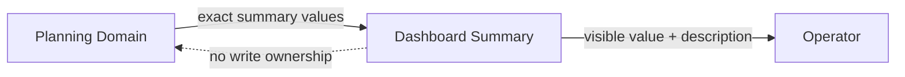
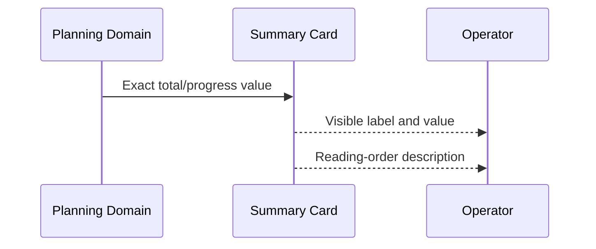

# ScopeWeave product-technical Gap baseline

Status: **Proposed**  
Canonical product writer: scopeweave#756  
Product evidence ancestor: `52a2ac8cef4d6289a88f5205f43f1c74e9f09bd5`

## Goal / PRD

The planning dashboard must present exact total-duration, planned-progress, and
actual-progress summaries without turning static information into keyboard
controls. Pointer users may retain native hover hints, while assistive
technology receives the same explanation from explicit document content.
Presentation markup never becomes project-plan domain truth.

## TRD

Each product-owned `.meta-value-card` remains a non-interactive
`role="note"`. It has no `tabindex` and no focus affordance. A stable
`aria-describedby` identifier points to an in-card `.sr-only` explanation.
The visible `strong` value remains the exact renderer target. A Node unit
contract parses shipped HTML and CSS and is included in `npm run test:unit`.

## Context Map

- Upstream owner: Planning Domain and its aggregate calculations.
- Downstream owner: Dashboard Summary presentation.
- Anti-corruption boundary: `role`, descriptions, and hover hints do not alter
  plan duration or progress facts.

## UML

## ERD

No entity, relation, column, persistence rule, or transaction aggregate changes.
The three cards consume already-computed values and do not write presentation
DTO state back into the plan.

## Exact-head acceptance matrix

| Concern | Evidence | Status |
|---|---|---|
| Determinism | Unit contract requires exactly three summary notes and three referenced descriptions | Source PASS; hosted pending |
| Semantics | Static cards use `role="note"`; no synthetic action or domain mutation | Source PASS |
| Accessibility | No `tabindex`; explicit `aria-describedby`; hidden descriptions exist; misleading focus selector absent | Source PASS; browser/AT pending |
| Keyboard | Cards add zero no-action stops; surrounding real tab sequence not replayed | Partial |
| Pointer/touch | Native title remains for pointer hover; touch explanation and AT replay absent | Pending |
| Responsive | 320px, 768px, and desktop screenshots absent | FAIL |
| Locales | ko/en/ja/zh/vi/es/de/fr resources, wrapping, expansion, and fallback absent | FAIL |
| States | Summary normal state exists; loading/empty/error/offline/permission/read-only/stale/conflict/retry/busy evidence absent | Pending |
| Performance | No new runtime listener; dashboard median/p95 and p95 ≤20 ms evidence absent | FAIL |
| Persistence/reload | Read-only cards; exact values after reload and recovery are not replayed | Pending |
| Import/export | No contract change; structured table/export parity is not evidenced here | Pending |

## Gap / Action / status

| Gap | Required action | Status |
|---|---|---|
| Synthetic keyboard stops | Keep notes non-focusable and protect with the integrated unit contract | Repaired; checks pending |
| Native-title dependence | Preserve pointer hint but provide explicit document descriptions | Repaired; AT pending |
| Browser evidence | Replay reading and tab order in Chromium, Firefox, and WebKit with AT | Open |
| Responsive and locale evidence | Capture 320/768/desktop across ko/en/ja/zh/vi/es/de/fr | Open |
| Recovery and exact values | Verify reload/import paths preserve exact visible summaries and structured alternatives | Open |
| Performance | Measure realistic dashboard render/update median and p95 without shrinking data | Open |

## Release decision

scopeweave#756 remains **Draft/Proposed** until exact-head CI and security checks
are terminal GREEN, a current independent approval exists, and applicable
browser, AT, responsive, locale, recovery, structured-alternative, and
performance rows pass. No release or publication is claimed.
