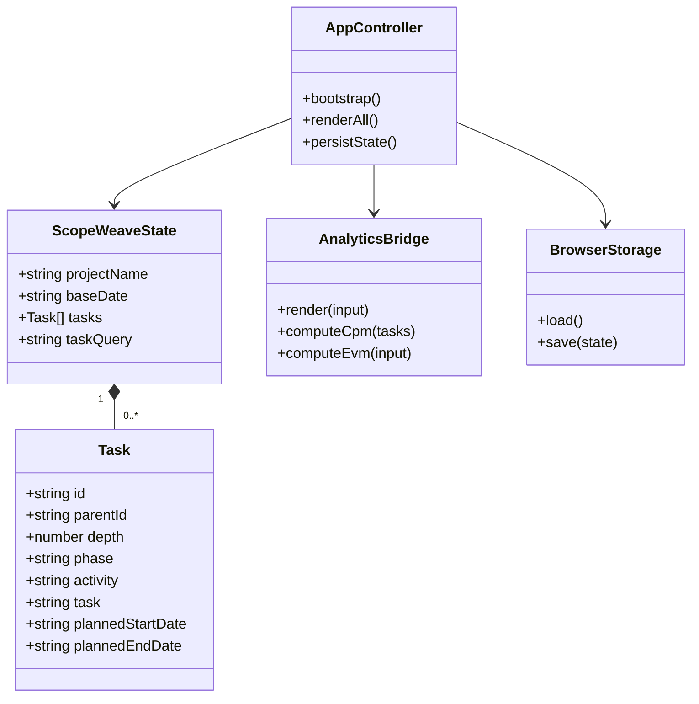

# ScopeWeave 제품·기술 Gap Baseline

> 기준일: 2026-08-29  |  보호 기준 브랜치: `develop`  |  보호 기준 HEAD: `2c328875e00e86537df3e965170be80532571cad`

이 문서는 저장소의 PRD 역할을 하는 설계 문서와 README, 기술 계약,
구현·테스트·운영 게이트를 현재 파일과 실행 증거에 연결하는 기준선이다.
별도 `PRD.md`는 없으며, 제품 요구의 원문은
[`docs/plans/2026-04-20-scopeweave-design.md`](plans/2026-04-20-scopeweave-design.md)와
[`README.md`](../README.md)이다. 아래의 “완료”는 보호된 `develop`에 실제로
존재하는 것만 뜻한다. 열린 PR의 구현은 별도 제출 상태로 기록한다.

## 1. 제품 목표와 구매자

주 구매자는 일정·공정 데이터를 WBS로 관리하고 계획 대비 실적과 지연
원인을 설명해야 하는 PM과 PMO다. 제품의 핵심 가치는 다음과 같다.

1. `단계 > Activity > Task` 구조를 빠르게 편집한다.
2. 날짜·진척·선행작업에서 일정 통제 신호를 재현 가능하게 계산한다.
3. CSV와 브라우저 저장으로 별도 플랫폼에서도 계획을 회수한다.

현재 제품은 정적 브라우저 클라이언트와 선택적 Node SaaS 계층으로 나뉜다.
정적 호스팅에서 서버 파일을 덮어쓰지 않는 제약은 유지한다.

## 2. PRD/TRD 추적성

| 요구 | 보호된 `develop` 구현 증거 | 상태 |
| --- | --- | --- |
| 3단계 WBS 편집·계층 보존 | `app.js`의 단일 `state.tasks`, `renderAll()`, expand/collapse·subtree 이동 | 완료 |
| 계획/실적 진척 및 일정 통제 | `analytics.js`의 EVM, S-curve, CPM, workload | 완료 |
| 작업 검색과 계층 맥락 유지 | 현재 `develop`에는 미포함. #621의 `4c8d09d` 제출본에 구현됨 | 제출됨, 병합 대기 |
| CSV 왕복 | `exportCsv()`, CSV parser/validation, E2E·fuzz 계약 | 완료 |
| JSON seed·localStorage·선택적 파일 sync | `loadSeedTasks()`, `localStorage`, `exportJsonArray()`, File System Access API | 완료 |
| 명시적 JSON 다운로드 | 현재 `develop` UI에는 없음. #621의 `4c8d09d` 제출본에 구현됨 | 제출됨, 병합 대기 |
| 첫 방문 샘플 안내와 빈 계획 전환 | 현재 `develop`에는 미포함. #624가 #621에 병합되어 제출됨 | 제출됨, 병합 대기 |
| 정적 배포 | `pages.yml`, 상대 경로 자산, `404.html` | 구현 완료, 실제 출판 증거 필요 |
| Cloud 인증·멀티테넌시·협업 | `server/`, `cloud-sync.js`, API smoke/E2E | 코드·테스트 존재, 운영 환경 검증 필요 |

## 3. UML 및 데이터 흐름

`tasks`가 유일한 원천이며 사용자 입력·파일 seed·Cloud snapshot은 이 상태로
정규화된다. 화면 갱신은 `renderAll()` 하나를 통과하고 분석은
`window.ScopeWeaveAnalytics` 경계를 통해 호출된다.

## 4. 현재 PR 및 Gap 조치 상태

이 표는 2026-08-29의 GitHub exact-head snapshot이다. Checks와 리뷰는
HEAD가 바뀌면 다시 확인해야 한다.

| ID | Gap / 고객 영향 | 현재 제출 상태 | 조치 |
| --- | --- | --- | --- |
| G-01 | 큰 WBS에서 작업 위치를 찾는 비용 | #621 `4c8d09d`, `develop` 병합 대기 | 작업·담당자·산출물 등 필드 검색과 상위 계층 표시 |
| G-02 | 정적 사용자가 JSON을 회수하려면 파일 API에 의존 | #621 `4c8d09d`, `develop` 병합 대기 | 브라우저 JSON 다운로드와 계획 필드 보존 |
| G-03 | 첫 방문자가 seed와 실제 계획을 혼동 | #624 `69eff955`가 #621에 병합됨, `develop` 병합 대기 | 샘플 안내, 숨김, 확인 가능한 빈 계획 전환 |
| G-04 | 핵심 상태의 시각 회귀 증거 부족 | #509 `ea90277`, `develop` 병합 대기 | 실제 브라우저 screenshot과 WCAG 2.2 점검을 릴리스 증거에 포함 |
| G-05 | PR 큐가 provider 실패와 승인 부재로 정지 | #495/#621/#625/#628 OpenCode current verdict 부재; #621 Strix provider 실패; #576 Strix가 현재 webhook 경로의 SSRF를 보고; #578/#588 Strix provider 실패; #608 `83b8949`·#610 `3bb2bd9`·#587 `1f93371` Checks 재실행 중; #498 `9408588`·#505 `b8435c7` 수정 후 Checks 재실행 중; #602 `78e8037` Hono 보안 패치 후 Checks 재실행 중; #531 `b6842e7`·#601 `98f4354` Strix provider 실패; #515 `36c11dd`는 Checks/Strix 통과지만 승인 없음; #550은 Checks 통과지만 승인 없음; #596은 Checks 통과지만 승인 없음 | 게이트를 약화하지 않고 로그·artifact·exact HEAD 재검증 |

### Exact-head queue evidence

- #621: `develop@2c328875` 대상
  `4c8d09d17024202a1f5236ef62b31a8b5d9480c1`. CSV 성공 import 시 stale 검색어를
  초기화하고, 첫 방문 seed 탐색 중 progress/order 변경이 sample을 영속화하지 않으며,
  빠른 검색 입력의 전체 재렌더를 디바운스하는 현재 제출본이다. local unit·API와
  검색·온보딩 focused E2E 6개는 통과했지만 OpenCode는 current-head verdict 부재로,
  Strix는 provider HTTP 500과 vulnerability report 부재로 fail-closed 되었고
  qualifying approval도 없다.
- #509: `develop@2c328875` 대상
  `ea9027743ebafd1ca5774a5a14227585cf796052`. summary metric explanation을
  keyboard stop 없이 지속 노출하고 gradient 대비를 보강한 접근성 제출본이다.
  focused 접근성·literal-title E2E 6개와 hosted required Checks·Strix는 통과했지만
  `REVIEW_REQUIRED`이며 qualifying approval이 없어 병합하지 않았다.
- #610: `3bb2bd95905d590fe3d1d0d9a8fc6c6ec133c04a` (base
  `develop@2c328875`). 이전 exact head의 Cloud E2E가 JSON sync에서 텍스트
  `predecessors`/`sprint`의 `0`·`false`를 보존하는 결함을 검출했고, 이를
  `task.predecessors || ''` 및 `task.sprint || ''`로 수정했다. 현재 head의
  replacement Checks는 재실행 중이며, qualifying approval은 없다.
- #608: `83b8949157e0bb6cd9a8b967c807e9238ddac943` (base
  `develop@2c328875`). 빈 상태 도움말의 DOM `hidden` 상태를 `renderAll()`의
  작업 존재 여부와 동기화하고, 제거된 tooltip을 기대하던 기존 E2E를
  `disabled`·`aria-describedby`·지속 설명 계약으로 갱신했다. focused E2E와
  unit은 통과했으며, 현재 head의 hosted Checks는 재실행 중이고 승인은 없다.
- #587: `1f93371c9df84a2f60dd3386c6429d63d750c50c` (base
  `develop@2c328875`). 직접 소비 가능한 `application_routes_core.mjs`가
  오래된 첫 `x-forwarded-for` 기반 limiter를 사용하던 경계를 제거하고,
  `server/rate_limit.mjs`의 설정 검증·trusted transport peer·bucket 상한을
  공유하도록 했다. direct-core rate-limit, 전체 coverage/API는 로컬 통과했으며,
  replacement hosted Checks는 queued이고 qualifying approval은 없다.
- #596: `50f0c2d18e4361e5f11507ca194c94fc7caabbdc`. 공급자 진단을 고객에게
  노출하지 않는 502 envelope이며 hosted 보안·테스트·OpenCode·Strix·Devin
  Checks는 통과했지만 qualifying approval이 없어 병합하지 않았다.
- #550: `9267d2d7686ea7891591a600187ebc21428b13ba` (base
  `develop@2c328875`). 로컬 CSV와 cloud 조직·캘린더·감사 로그 다운로드가
  공유된 안전한 임시 앵커 경로를 사용하고, 설정·click·cleanup·URL revoke
  오류의 최초 원인을 보존한다. 현재 hosted required Checks는 통과했고
  Devin은 결함을 보고하지 않았지만 qualifying approval이 없어 병합하지 않았다.
- #578: `e9575ee404ae9c725d009833639f12a0d890df9e` (base
  `develop@2c328875`). 첨부·코멘트 모달의 task label lookup을 한 번의 Map
  구성으로 바꾸고 2,000-task/40-comment 브라우저 회귀를 통과했다. 현재
  hosted Strix는 provider/backend unavailable로 authoritative report를
  만들지 못했고 qualifying approval도 없어 병합하지 않았다.
- #623: stacked base `refactor/schema-migration-ledger-433@9f2e6818` 대상
  `81072df8f4dd2e2df269710eb7cc852312ff7543`, draft 상태. canonical SQLite
  rename의 31개 schema/migration 테스트는 통과했지만 독립 병합 근거가 없다.
- #552: `develop@2c328875` 대상 `92487d1f9e5215cd4b7302275c23393596799ba3`,
  draft 상태. 일반 hosted 게이트는 통과하고 Strix는 취약점 0건을 출력한 뒤
  provider 장애와 authoritative report 부재로 fail-closed 되었다.
- #588: `develop@2c328875` 대상 `bc60476829ec98f37d83977a9432b79ba0b3c0d6`.
  outbound webhook SSRF 단일 수정 경로로서 encoded IP, IPv4/IPv6 special-use
  주소, DNS rebinding, pinned connection, legacy destination migration을 다룬다.
  일반 hosted 게이트는 통과했지만 Strix provider 실패와 qualifying approval
  부재로 병합하지 않았다.
- #498: `fix/clearfolio-production-configuration@78f8b557` 대상
  `940858859b27060241864e633659f656907616b1`. 이전 hosted unit-and-api가
  persistence `TimeoutError` 회귀 테스트의 잘못된 `READY` fixture를
  `invalid_status`로 분류해 실패했다. 공유 분류 함수는 provider lookup
  단계에서만 native `TimeoutError`를 timeout으로 매핑하고, fixture는 유효한
  `SUCCEEDED`로 고쳤다. local coverage/unit/API는 통과했으며 replacement
  Checks는 queued이고 qualifying approval은 없다.
- #505: `develop@2c328875` 대상
  `b8435c719baf4ee9eaa2907e2c93c6d959711d66`. provider가 반환한 Checkout
  redirect가 임의 HTTPS 호스트로 향하지 않도록 정확한
  `checkout.stripe.com` 기본 포트를 검증하는 최소 보완을 넣었다. local
  billing unit/API는 통과했으며 replacement hosted Checks는 queued이고
  qualifying approval은 없다.
- #511: stacked base
  `fix/stripe-checkout-provider-boundary-488@5d1bf1b023d4152610d9bc247c02da27429d33cd` 대상
  `01be3a5d59979e4c52d17bfaa4428c177dec0237`. Checkout attempt idempotency와
  durable provider outcome 경계를 점검했고 current local billing unit/API와
  hosted stacked Checks는 통과했지만 qualifying approval은 없다.
- #537: stacked base `feat/clearfolio-capability-readiness-489@9e465a2c` 대상
  `abcd68c20ef073818d1869f2a5e891fb99248a05`. Clearfolio configuration
  readiness를 liveness와 분리하고 authenticated capability/503 표면을
  추가한 제출본으로 local readiness·unit·API는 통과했다. 전체 E2E의 1개
  modulepreload 실패는 이 stack 이전의 #628/#495 경로이며, stacked hosted
  Checks는 통과했지만 protected develop 승인 근거는 없다.
- #602: `develop@2c328875` 대상 `78e803718d1c90a09c7827cc98c980e99e231454`.
  Hono를 registry 최신 보안 패치 4.13.5로 갱신하고 package/lockfile을 함께
  재생성했다. `npm ci`, production `npm audit`(취약점 0), unit·API·coverage는
  통과했다. 전체 E2E는 75/76 통과했으며 유일한 실패는 기존
  `modulepreload` 링크 기대다. 이전 4.13.4 head의 OpenCode verdict 부재와
  Strix LLM HTTP 500은 current-head 보안 판정이 아니며, 새 head replacement
  Checks는 queued/in-progress이고 qualifying approval은 없다.
- #515: `develop@2c328875` 대상 `36c11dd0bf907569184d7d73172b675d21bd0ff1`.
  four-level hierarchy domain의 immutable projection이 persisted `kind`와
  `sourceIndex`를 nested `record` 안에서 보존하는지 current CodeGraph와
  CodeRabbit 지적을 대조 검토했다. hierarchy unit 10개와 전체 unit·API·coverage가
  통과했고 hosted Checks와 Strix도 통과했지만 qualifying approval은 없다.
- #531: `develop@2c328875` 대상
  `b6842e7cf60f77b1d5cee04e1c020e411afc9a6f`. SQLite backup의 read-only
  source/WAL 처리, bounded schema streaming, destination race 방지,
  source replacement guard와 recovery 문서 포인터를 current CodeGraph·테스트·리뷰
  지적과 대조했고 focused recovery/output/schema/source/temp 테스트는 통과했다.
  Strix artifact는 `invalid_tools` 400으로 중단되어 authoritative clean verdict가
  없고, qualifying approval도 없어 병합하지 않았다.
- #601: `develop@2c328875` 대상
  `98f4354733c68c9f361e516f86ba2d95e97af20`. 날짜 formatter의 native-compatible
  zero-padding과 benchmark checksum fail-closed 수정을 current CodeGraph·리뷰와
  대조했다. unit·API·coverage는 통과했고 전체 E2E는 78/79 통과(유일한 실패는
  기존 `modulepreload` 기대)했으며, Strix는 NVIDIA 429/OpenAI 404 provider
  실패로 authoritative clean verdict가 없다. qualifying approval도 없어 병합하지
  않았다.
- #576: `develop@2c328875` 대상 `62484c2dbeb755fd80fbc123d34e55df7755bda8`.
  Strix exact-head report가 기존 webhook 등록 경로에서 인증 사용자가
  내부 주소로 outbound 요청을 유도할 수 있는 MEDIUM SSRF를 보고했다.
  이 경로의 canonical 수정은 #588에 단일화했으므로 #576에는 중복 패치를
  넣지 않고, #576은 해당 보안 근거와 승인 부재로 병합하지 않았다.
- #628: `develop@2c328875` 대상 `7d27ff23a3eac6548b904f91f2282f0efcc5c5a5`.
  비상호작용 tooltip의 keyboard focus, semantic role, focus-visible 표시를
  추가했고 단독 E2E 75개가 통과했다. 현재 base의 modulepreload 누락으로
  기존 static E2E 1개가 실패하며, OpenCode current-head verdict 부재와
  qualifying approval 없음으로 병합하지 않았다.
- #495: `develop@2c328875` 대상 `9cc7ecc204dafe3dafcb78b605455beb07bbce3b`.
  정적 shell의 `cloud-sync.js`·`analytics.js` modulepreload를 제공하는
  제출본이다. #628에서 확인한 기존 E2E 실패의 별도 소유 경로이며, OpenCode/
  Strix 게이트와 qualifying approval을 재확인해야 한다. 로컬 5,000행
  production benchmark는 180초 제한에서 interaction probe가 종료되지 않아
  hosted 성능 증거로 대체하지 않았다.
- #626: `d0141077d3bb790786520efa3d115d4dd2ce70bf`는 #508의
  `computeTaskMetrics` 최적화와 중복되어 종료했다. #627:
  `c91715a4ad4f8865e7e6a90ffc51fdb8b16fd360`은 문자열 필터만으로는
  encoded IP·DNS rebinding을 막지 못해 종료하고, 보안 수정은 #588에
  단일화했다.
- #624: `69eff955bc16295a6d82b72174b25d8ec94345c1`은 base
  `feat/wbs-search-context`에 normal squash merge되어 단일 squash commit
  `5f8a3d7759aef628f4bcf06f3780c53737ca2a53`가 되었다.

## 5. 품질·보안 기준선

- 런타임 의존성은 브라우저 native API와 현재 서버의 최소 의존성만 사용한다.
- `app.js`는 `new Function` 테스트 계약 때문에 top-level ESM import/export를
  사용하지 않는다.
- 입력은 신뢰 경계에서 길이·날짜·CSV 수식·JSON prototype pollution을 검증한다.
  확인된 앱 UI의 동적 텍스트 출력은 `textContent` 경로를 사용하고,
  `innerHTML`은 cloud-sync의 상수 UI 템플릿으로 제한한다. `escapeHtml()`은
  현재 호출 경로가 확인되지 않아 보안 근거로 세지 않는다.
- 접근성은 레이블, landmark, keyboard focus, live status, disabled 상태,
  reduced motion을 최소 기준으로 삼는다.
- 검증 명령은 `npm run test:unit`, `npm run test:api`, `npm run test:e2e`,
  `python3 -m pytest tests/config`, `npm run fuzz`다.
- 현재 exact-head 제출본의 로컬 증거는 PR별로 분리하며, predecessor·synthetic
  merge·pending·skipped·provider-failed evidence는 통과로 승격하지 않는다.

## 6. 표준·연구 근거 (APA 7th)

국제표준화기구. (2020). *ISO 21502:2020: Project, programme and portfolio
management—Guidance on project management*. https://www.iso.org/standard/74947.html

국제표준화기구. (2018). *ISO 21511:2018: Work breakdown structures for
project and programme management*. https://www.iso.org/standard/69702.html

국제표준화기구. (2026). *ISO 21508:2026: Project, programme and portfolio
management—Earned value management*. https://www.iso.org/standard/87899.html

World Wide Web Consortium. (2024). *Web Content Accessibility Guidelines
(WCAG) 2.2*. https://www.w3.org/TR/WCAG22/

Souppaya, M., Scarfone, K., & Dodson, D. (2022). *Secure software development
framework (SSDF) version 1.1: Recommendations for mitigating the risk of
software vulnerabilities* (NIST Special Publication 800-218). National Institute
of Standards and Technology. https://doi.org/10.6028/NIST.SP.800-218

상세한 PM 분석 연구·표준 매핑은
[`docs/research/pm-analysis/README.md`](research/pm-analysis/README.md), 설계 결정은
[`docs/plans/2026-04-20-scopeweave-design.md`](plans/2026-04-20-scopeweave-design.md)에
보존한다.
