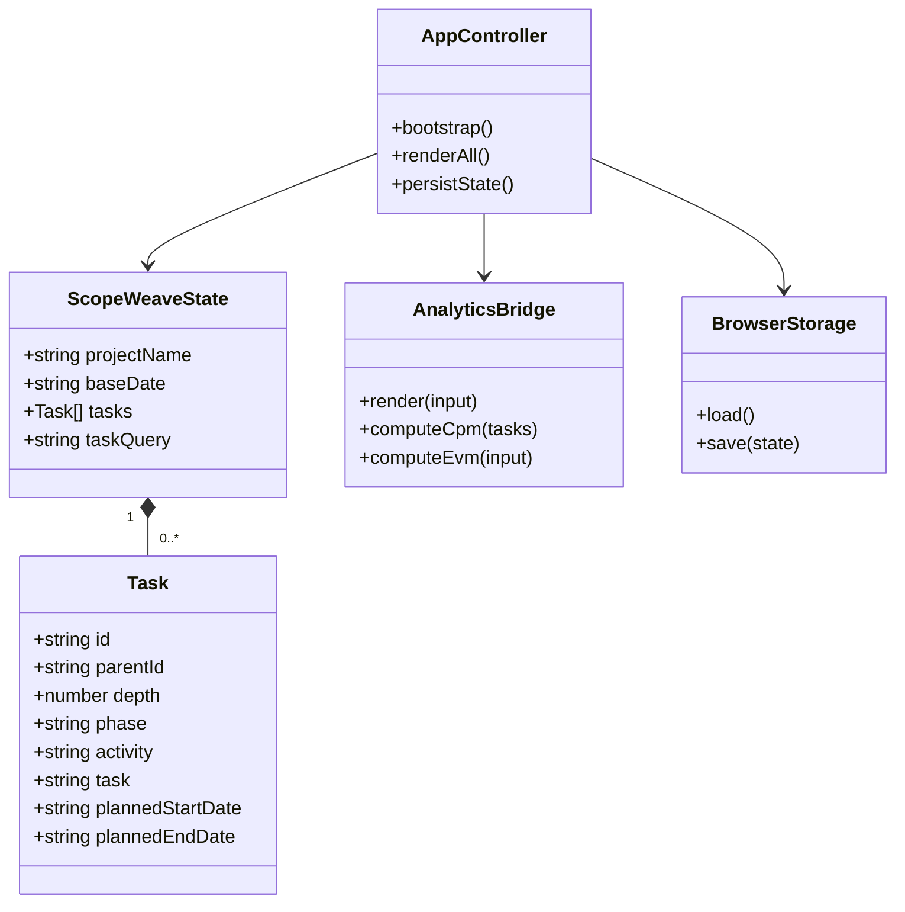

# ScopeWeave 제품·기술 Gap Baseline

> 기준일: 2026-08-28  |  기준 브랜치: `develop`  |  기준 HEAD: `2c328875e00e86537df3e965170be80532571cad`

이 문서는 현재 저장소의 PRD, 기술 계약, 구현, 테스트, 운영 게이트를 한
곳에서 추적하는 기준선이다. 문서의 상태는 의도나 열린 PR의 제목이 아니라
현재 파일과 실행 증거를 기준으로 기록한다.

## 1. 제품 목표와 구매자

주 구매자는 일정·공정 데이터를 WBS로 관리하고, 계획 대비 실적과 지연
원인을 설명해야 하는 PM과 PMO다. 제품의 핵심 가치는 다음 세 가지다.

1. `단계 > Activity > Task` 구조를 빠르게 편집한다.
2. 날짜·진척·선행작업에서 일정 통제 신호를 재현 가능하게 계산한다.
3. CSV와 브라우저 저장을 통해 별도 플랫폼에서도 계획을 회수한다.

현재 범위는 정적 브라우저 클라이언트와 선택적 Node SaaS 계층이다. 정적
호스팅에서 서버 파일을 덮어쓰지 않는다는 제약은 유지한다.

## 2. PRD/TRD 추적성

| 요구 | 현재 구현 증거 | 상태 |
| --- | --- | --- |
| 3단계 WBS 편집·계층 보존 | `app.js`의 단일 `state.tasks`, `renderAll()`, expand/collapse·subtree 이동 | 완료 |
| 계획/실적 진척 및 일정 통제 | `analytics.js`의 EVM, S-curve, CPM, workload, PM readiness | 완료 |
| 계획을 찾고 계층 맥락을 유지 | `#task-filter`, `getVisibleTasks()`, `tests/e2e/scopeweave.spec.js` 검색 회귀 | 완료(이번 변경) |
| CSV 왕복 | `exportCsv()`, CSV parser/validation, E2E·fuzz 테스트 | 완료 |
| JSON seed·로컬 자동 저장 | `loadSeedTasks()`, `localStorage`, `exportJsonArray()`, JSON download | 완료 |
| 정적 배포 | `pages.yml`, 상대 경로 자산, `404.html` | 구현 완료, 실제 출판은 별도 런타임 증거 필요 |
| Cloud 인증·멀티테넌시·협업 | `server/`, `cloud-sync.js`, API smoke/E2E | 코드·테스트 존재, 운영 배포는 환경별 검증 필요 |

## 3. UML 및 데이터 흐름

`tasks`가 유일한 원천이며, 사용자 입력·파일 seed·Cloud snapshot은 이
상태로 정규화된다. 화면 갱신은 `renderAll()` 하나를 통과하고, 분석은
`window.ScopeWeaveAnalytics` 경계를 통해 선택적으로 호출된다.

## 4. Gap 및 조치 상태

| ID | Gap / 고객 영향 | 조치 | 상태 |
| --- | --- | --- | --- |
| G-01 | 큰 WBS에서 작업 위치를 찾는 비용이 높았음 | 작업·담당자·산출물 등 고객 필드를 검색하고 일치 행의 상위 계층을 함께 표시 | **완료** |
| G-02 | 정적 사용자가 JSON을 파일로 회수하려면 File System Access API에 의존 | 추가 계획 필드를 보존하는 브라우저 다운로드용 JSON export를 추가하고, 자동저장 seed 계약은 유지 | **완료** |
| G-03 | 빈 화면에서 첫 계획을 만드는 안내가 seed 데이터 유무에 따라 달라짐 | 최소 온보딩/샘플 사용 경로와 삭제 가능한 샘플 상태를 제품 결정 후 추가 | 조사 필요 |
| G-04 | 키보드·스크린리더 회귀는 E2E 일부로 보호되지만 시각 회귀 자동 검사는 없음 | 핵심 상태의 실제 브라우저 스크린샷과 WCAG 2.2 점검을 릴리스 증거에 포함 | 다음 검증 |
| G-05 | 보호 PR 큐는 소스와 무관한 Strix 공급자 429/Invalid URL 및 승인 부재로 차단될 수 있음 | 게이트를 약화하지 않고 원인 로그·artifact·현재 HEAD를 재검증한 뒤 재실행/중앙 수정 | 외부 상태 대기 |

## 5. 품질·보안 기준선

- 런타임 의존성은 브라우저 native API와 현재 서버의 최소 의존성만 사용한다.
- `app.js`는 `new Function` 테스트 계약 때문에 top-level ESM import/export를
  사용하지 않는다.
- 입력은 신뢰 경계에서 길이·날짜·CSV 수식·JSON prototype pollution을
  검증하고, 동적 HTML 삽입 대신 `textContent`를 사용한다.
- 접근성은 레이블, landmark, keyboard focus, live status, disabled 상태,
  reduced motion을 최소 기준으로 삼는다.
- 검증 명령은 `npm run test:unit`, `npm run test:api`,
  `npm run test:e2e`, `python3 -m pytest tests/config`, `npm run fuzz`다.
  이번 G-01/G-02의 직접 증거는 `npm run test:e2e` 83개 통과와 검색·JSON 회귀 테스트의
  통과다.

## 6. 표준·연구 근거

- 국제표준화기구. (2020). *ISO 21502:2020: Project, programme and portfolio
  management—Guidance on project management*. https://www.iso.org/standard/74947.html
- 국제표준화기구. (2018). *ISO 21511:2018: Work breakdown structures for
  project and programme management*. https://www.iso.org/standard/69702.html
  현재 개정안 ISO/DIS 21511은 초안이므로 이 기준선의 normative 계약으로
  사용하지 않는다.
- 국제표준화기구. (2026). *ISO 21508:2026: Project, programme and portfolio
  management—Earned value management*. https://www.iso.org/standard/87899.html
- World Wide Web Consortium. (2024). *Web Content Accessibility Guidelines
  (WCAG) 2.2*. https://www.w3.org/TR/WCAG22/
- Souppaya, M., Scarfone, K., & Dodson, D. (2022). *Secure software
  development framework (SSDF) version 1.1: Recommendations for mitigating
  the risk of software vulnerabilities* (NIST Special Publication 800-218).
  National Institute of Standards and Technology.
  https://doi.org/10.6028/NIST.SP.800-218

Repository-specific research and existing design decisions remain linked from
[`docs/plans/2026-04-20-scopeweave-design.md`](plans/2026-04-20-scopeweave-design.md),
[`docs/research/pm-analysis/README.md`](research/pm-analysis/README.md), and
[`ARCHITECTURE.md`](../ARCHITECTURE.md).
